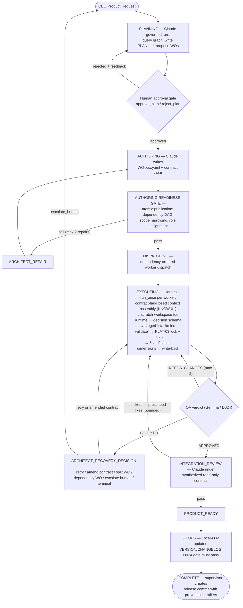

# Pruning Report — stackmind-cli

**Date:** 2026-10-06 · **Branch:** `agent_IO_config` · **HEAD:** `9a4b91b`
**Status: APPROVED (2026-10-06) — Tier A + Tier B executed on branch `chore/prune-irrelevant-artifacts` (D025-compliant: backup, precondition check, forward commits only). Amendment: `docs/STACKMIND_CLI.md` changed from DELETE → ARCHIVE per approval. Tier C deferred to a separate pass.**

---

## 1. Executive summary

A full-repo sweep (460 tracked files) found the **Python code base is clean**:

- ~130 modules under `cli/`, `cli/tui/`, `validators/` — **zero orphan modules** (every module is imported by `cli/main.py`, package `__init__` re-exports, other modules, or tests).
- **Zero dead functions** in the six largest modules (`supervisor.py` 3,643 LOC, `app.py` 3,007, `runner.py` 2,737, `manager.py` 2,464, `gateway.py` 1,885, `tools.py` 1,876).
- **No unused runtime dependencies** (click, pyyaml, jsonschema, rich all imported; `sentence-transformers` lazily imported matching its optional extra).
- `ruff` F401/F811/F841 **clean**. All **1,244 tests collect with 0 errors**; no empty or skipped-away test files. No commented-out code blocks, no TODO debt.

The genuine pruning targets are **tracked root artifacts and stale docs** — a superseded legacy TUI demo, a byte-identical launcher duplicate, one-off agent-session reports parked at the repo root, a two-major-version-stale platform doc, a divergent doc duplicate, and committed pytest logs. Proposed removal is ~85 KB of text clutter + the 1.5 MB screenshot relocated out of the root + 4 dead launcher/REPL files.

## 2. Method

1. Inbound-import sweep for every module under `cli/`, `cli/tui/`, `validators/`, `schemas/`, `migrations/` (leaf-name grep across repo incl. tests).
2. Dead-function spot-check of the 6 largest modules (cross-file reference greps).
3. Tracked-status + last-git-touch audit of every root artifact (`git ls-files`, `git log -1 -- <file>`).
4. Cross-reference greps (code, tests, CI, docs) for every candidate below.
5. `pytest --collect-only` (0 errors) and `ruff check` as a clean-baseline.
6. `.sync/` (40,283 files, 144 MB) is fully gitignored compiler/runtime state — **not a git problem**; its bulk (`knowledge/cache/reverse_index/`, 53 MB) is regenerable by design. Untouched.

## 3. Tier A — safe to remove (recommend: DELETE)

| # | File | What it is | Evidence | Last touched |
|---|------|-----------|----------|--------------|
| A1 | `start_tui.cmd` | Launcher duplicate | Byte-identical to `start_tui.bat` (`cmp` → identical, verified this session); nothing references `start_tui` in any doc/CI | 2026-09-08 |
| A2 | `docs/runtime-truth/.wo-025-full-pytest.err` | 0-byte committed pytest stderr capture | Hidden dotfile; referenced only as evidence by `docs/runtime-truth/P7-technical-audit-report.md` → **archive the pair** to `docs/archive/wo-025-evidence/` so the audit citation stays resolvable | 2026-09-13 |
| A3 | `docs/runtime-truth/.wo-025-full-pytest.out` | 114-byte committed pytest stdout capture | Same as A2 (archive together) | 2026-09-13 |
| A4 | `debug_keys.log` (root) | 630 KB local debug log (key-event spam) | **Untracked** (ignored via `*.log`); sensitive-content scan → 0 matches for key/token/secret patterns; not a git problem — delete from disk with a local backup copy first | on disk, 2026-09-23 |
| A5 | `docs/STACKMIND_CLI.md` | Older divergent duplicate of root `STACKMIND-CLI.md` | Same document in two places: docs copy 391 lines (2026-09-19) vs root 454 lines (2026-10-01, newer superset); neither referenced by code/CI | 2026-09-19 |

## 4. Tier B — superseded / misplaced (recommend: DELETE or ARCHIVE)

| # | File(s) | What it is | Evidence | Proposed action |
|---|---------|-----------|----------|-----------------|
| B1 | `tui.py` (root) | Legacy demo REPL "TUI v3.2.0 GA" (hardcodes fake diffs/demo contracts) | Superseded by `stackmind tui` (`cli/main.py:402` → `cli/tui/app.py`, 3,007 lines + ~15 dedicated `test_tui_*.py` files). Only references in the whole repo are the three `start_tui.*` launchers; launchers are referenced by nothing; `docs/runtime-truth/P6-P7-baseline.md:39` explicitly calls root `tui.py` a prototype superseded by a Click subcommand. **Not** in the wheel packages; removal does not orphan `validators/kernel/tui/` (heavily used by `cli/tui/app.py:109`) | **DELETE** |
| B2 | `start_tui.bat`, `start_tui.ps1` | Launchers for the legacy REPL | Claim "v3.2.0 GA" vs actual 3.7.0; hardcode `.venv\Scripts\python.exe`; referenced by nothing else | **DELETE** |
| B3 | `STACKMIND.md` (537 lines) | Platform README pinned to "Version: 2.1.0-dev" | Two major versions stale; only inbound reference is `RELEASE-v2.0.0.md`; superseded by root `STACKMIND-CLI.md` (v3.3.0+) and `docs/STACKMIND_ARCHITECTURE.md` | **ARCHIVE** → `docs/archive/` |
| B4 | `RELEASE-v2.0.0.md` | v2.0.0 release notes | Project at 3.7.0; `CHANGELOG.md` already carries release history | **ARCHIVE** → `docs/archive/` |
| B5 | `report.md`, `pA_agent_IO_config.md`, `PHASE_A_FACT_FINDING.md`, `stackmind-tui-analysis.md`, `tui-checklist.md`, `demo.md` | One-off agent-session analysis/decision artifacts parked at repo root (collectively ~110 KB) | Zero code/CI/README references; they reference only each other or nothing; content overlaps `docs/` (`TUI_BUGFIX*`, `P6_TUI_*`); several analyze superseded versions (`stackmind-tui-analysis.md` audits v3.3.0, current 3.7.0; `report.md` recommends the rejected TypeScript/OpenTUI frontend per `docs/P6_TUI_ADOPTION_DECISION.md`) | **ARCHIVE** → `docs/archive/agent-sessions/` |
| B6 | `StackMind_Interactive_Architecture.html` (21 KB) | Hand-built interactive architecture page | Referenced by nothing; docs/ has its own `diagrams/` convention | **ARCHIVE** → `docs/archive/` |
| B7 | `image.png` (root, 1.5 MB) | TUI design-target screenshot — largest tracked file | Never loaded by code; referenced by 6 docstrings/comments (`cli/tui/app.py:571`, 5× `tests/test_tui_visual_fidelity.py`) as the visual-fidelity target | **MOVE** → `docs/assets/image.png` + update the 6 docstring references to the new path |
| B8 | `README.md` | Project scaffold README | Says "Version: v3.1.0" (actual: 3.7.0 per `pyproject.toml`/`VERSION`); links to nonexistent `github.com/stackmind/stackmind` (pyproject says `Abhishek3670/stackmind`) | **FIX** content (not removal) |

## 5. Tier C — looks dead, needs separate sign-off (NOT executed in this pass)

These are listed for completeness; each has a citation or convention risk that deserves its own decision:

- **`docs/PLAN_TUI.md` + `PLAN_TUI_v2`…`v7`** (6,332 lines) — seven superseded planning iterations, but `tests/test_subagent_orchestration.py:3` and `docs/PLAN_STACKMIND_CLI_FINAL.md:7` cite specific sections (§29). Archive, don't delete, and update citations — separate pass.
- **Non-final/Final doc pairs** — `docs/STACKMIND_AGENT_RUNTIME_ROADMAP.md` vs `_FINAL.md`; `docs/StackMind_Verified_Procedural_Learning.md` vs `_FINAL.md` — non-final copies have zero inbound references but document roadmap history.
- **`docs/Project_Study_&_Future_Improvements.md`** vs the 105 KB `Project_Technical_Study_&_Future_Improvement_Report.md` — two parallel study docs; at minimum one is redundant.
- **`examples/minimal/`** — contains only a README describing files that don't exist in the directory. Either finish it or remove it (misleading as-is).
- **Root `PLAN.md`** — 12-line unfilled template stub, but protocol-wired: `AGENTS.md:49` tells agents to read `PLAN.md` (and `PLANv3.md`, which no longer exists at root — dangling reference). Keep; optionally fill it in and fix the `PLANv3.md` reference.
- **`docs/diagrams/*.html`** (5 files, incl. 714 KB `robust-supervisor-lifecycle.html`) — generated visuals referenced by nothing; regenerable, but may be intentionally published.

## 6. Explicit KEEP list (verified live, not candidates)

`cli/**` · `cli/tui/**` · `validators/**` · `tests/**` · `schemas/**` (including `escalation.schema.json` + `migration.schema.json` — zero code references today, but they ship in the wheel as protocol surface and `templates/sync/escalations/REWORK.template.yaml` implies them) · `templates/**` (consumed by `cli/init.py`) · `migrations/*.yaml` (loaded via glob by `cli/migrate.py:70`) · `docs/` core architecture + runtime-truth audit reports (minus A2/A3) · `AGENTS.md` · `CHANGELOG.md` · `STACKMIND-CLI.md` · `PLAN.md` (protocol-wired) · `BUG_PLAN.md` (deliberately gitignored local working file) · `.sync/**` (gitignored runtime state) · `workspace/`, `__agent__/` (untracked fixtures/scratch).

## 7. Execution plan (D025-compliant) — ONLY after your approval

1. **Backup & preconditions:** record `git log --oneline | wc -l` and confirm clean tree; copy `debug_keys.log` to a local backup dir before deleting (it's untracked — git history won't preserve it). All other targets are tracked, so git history is the backup; no history rewrite, forward commits only.
2. **Branch:** `chore/prune-irrelevant-artifacts` from current HEAD.
3. **Execute** Tiers A + B exactly as marked (B7 includes updating the 6 docstring references to `docs/assets/image.png`; B8 is the README version/link fix).
4. **Verify:** full `pytest` via the project venv (expect 1,244 passed) + `ruff check` + `stackmind validate .` — any failure → restore and report.
5. **Commit** (single commit, conventional message), re-check commit count, verify kept files still present, report SHA.

---

## 8. Governed multi-agent workflow (Mermaid source)

Portable version of the archify diagram at `docs/diagrams/governed-multi-agent-workflow.html` (reverse-engineered from `validators/kernel/daemon/supervisor.py`, `manager.py`, and `validators/harness/runner.py`).

**Governance gates (where they sit):** contract layer fail-closed (context assembly + tool gateway + pre/post-execution gates) · budget overrun ends session · AuthoringGate + Readiness Gate (before dispatch) · harness-output schema + bounded feedback retries (after each LLM call) · staged `stackmind validate` + 6 verification dimensions (before write-back) · PLAT-03 advisory lock + D025 destructive-op gate (under lock) · D024 QA-evidence gate (before GITOPS) · risk-tiered skill promotion (learning loop, separate from the WO lifecycle).
