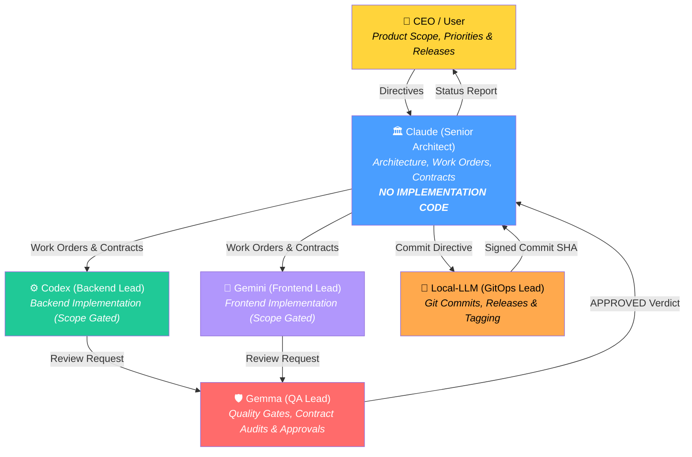
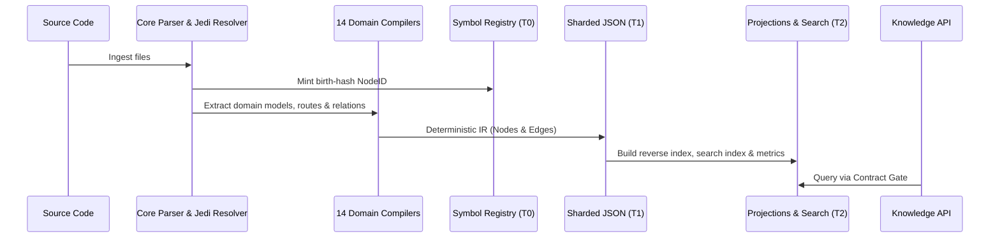

# STACKMIND
> Compiler-Backed Multi-Agent Engineering Runtime

**Version:** 2.1.0-dev · **Python:** ≥3.10 · **License:** MIT · **Author:** Abhishek Sharma

---

## Table of Contents
1. [What Is StackMind?](#1-what-is-stackmind)
2. [Quick Start](#2-quick-start)
3. [Architecture](#3-architecture)
4. [Knowledge Compiler (SKC)](#4-knowledge-compiler-skc)
5. [Code-Graph Intelligence](#5-code-graph-intelligence)
6. [Knowledge API & Unified RAG](#6-knowledge-api--unified-rag)
7. [Harness Runtime](#7-harness-runtime)
8. [CLI Reference](#8-cli-reference)
9. [Protocols & Governance](#9-protocols--governance)
10. [Migration Guide](#10-migration-guide)
11. [Multi-Agent Workflow Demo](#11-multi-agent-workflow-demo)
12. [Validation Layers](#12-validation-layers)
13. [File Structure](#13-file-structure)
14. [Tech Stack](#14-tech-stack)
15. [Key Design Decisions](#15-key-design-decisions)
16. [Team Evolution](#16-team-evolution)
17. [Incident History](#17-incident-history)
18. [References](#18-references)

---

## 1. What Is StackMind?

StackMind compiles your codebase into a persistent, queryable knowledge graph. Ask *"who calls this function?"*, *"what breaks if I rename it?"*, *"what data flows from request into SQL query?"*, or *"give me context for this task"* — and get instant, provenance-tracked answers without scanning files.

StackMind is also an operating system for teams of AI agents working on a shared software project. Every time an AI agent opens a project, it typically rebuilds its understanding from scratch — reading files, grepping, guessing, and hallucinating context. StackMind compiles that understanding once and makes it queryable forever. It provides three integrated pillars: **governance** (protocol & contract enforcement), a **knowledge compiler** (deterministic source understanding & code-graph intelligence), and a **harness** (governed agent execution).

```text
                         STACKMIND PLATFORM
                                 │
        ┌────────────────────────┼────────────────────────┐
        ▼                        ▼                        ▼
┌──────────────────┐   ┌──────────────────┐   ┌──────────────────┐
│     Pillar 1     │   │     Pillar 2     │   │     Pillar 3     │
│Runtime Governance│   │Knowledge Compiler│   │ Harness Runtime  │
│  & Contract Layer│   │ & Graph Intel    │   │  & Verification  │
│ (v1.2 + v3.0)    │   │ (v2.0 + POC)     │   │ (v2.0)           │
└──────────────────┘   └──────────────────┘   └──────────────────┘
```

### The Three Pillars

| Pillar | What It Does | Status |
|--------|-------------|--------|
| **1. Runtime Governance & Contract Layer** | Messaging, task management, session continuity, protocol enforcement, write locks, and **Contract Boundaries (`CONTRACT-01`)** | Shipped v1.2.0 + Hardened v3.0 |
| **2. Knowledge Compiler & Graph Intel** | Deterministic source→IR compilation, 14 domain compilers, runtime call tracing, data-flow analysis (`FLOWS_TO`), and real embeddings | Shipped v2.0.0 + Intelligence POC |
| **3. Harness Runtime** | Governed agent execution loop with Knowledge API integration, contract verification gates, and D025 destructive safeguards | Shipped v2.0.0 |

### Core Capabilities

| Capability | What It Does |
|---|---|
| **Contract Layer (`CONTRACT-01`)** | Stateful YAML contracts defining Agent Identity, allowed/denied subgraphs, and token/file budgets |
| **Inbox/Outbox Messaging** | Structured agent-to-agent communication with `_read/` deduplication |
| **Work Order Management** | Task lifecycle (`ACTIVE` → `BLOCKED` → `COMPLETED`) with deliverable tracking |
| **Boot Snapshots (`D021`)** | Session continuity across context-window limits — agents resume where they left off in <3KB |
| **Knowledge Compiler** | Deterministic source-to-IR: parse, resolve, store, project — byte-identical output |
| **14 Domain Compilers** | Dedicated compilers for FastAPI, Pydantic, SQLAlchemy, Django, Celery, Alembic, CI/CD, Docs, Configs, Tests, and Architecture |
| **Code-Graph Intelligence** | Runtime call tracing (`sys.setprofile`), bounded data-flow taint tracking (`FLOWS_TO`), and concrete `EmbeddingBackend` |
| **Symbol Registry** | Permanent identity (`NodeID`) with birth-hashes that survive renames, moves, and refactoring |
| **Knowledge API & Unified RAG** | Multi-signal retrieval (lexical + semantic + graph + runtime + flow) filtered strictly through contract boundaries |
| **Harness Runner (`HARNESS-01`)** | Governed execution loop: poll → contract check → assemble context → LLM → verify → write-back |
| **5-Layer Validation** | Schema, structure, protocol, boot integrity, and knowledge graph validation |
| **Write Lock & Promotions** | Advisory lock serializing canonical writes; validate-before-and-after promotion gate for worker drafts |
| **Destructive Safeguards (`D025`)** | Backup-verify-escalate gate before any non-reversible operations |

---

## 2. Quick Start

### Installation

```bash
pip install stackmind
```

Or install from source in development mode:
```bash
git clone https://github.com/Abhishek3670/stackmind.git
cd stackmind
pip install -e ".[dev]"
```

### Requirements

- Python ≥ 3.10
- Core dependencies: `click`, `pyyaml`, `jsonschema`, `rich` (optional: `sentence-transformers` via `stackmind[embeddings]`)
- Dev dependencies: `pytest`, `pytest-cov`, `ruff`

### Standalone Knowledge Graph (Zero Config)

Point StackMind at any codebase — no initialization or config required:
```bash
# 1. Compile entire project into deterministic knowledge store
stackmind graph build -p /path/to/project

# 2. Query symbols without scanning files
stackmind graph query "AuthService.login" -p /path/to/project

# 3. Discover callers (static + runtime confirmed)
stackmind graph callers "AuthService.login" -p /path/to/project

# 4. Impact analysis for refactoring
stackmind graph impact "AuthService.login" --depth 3 -p /path/to/project

# 5. Assemble bounded, ranked context for an LLM prompt
stackmind graph context "How does user authentication work?" --token-budget 2000 -p /path/to/project
```

### Multi-Agent Governance Setup

Initialize a governed multi-agent workspace:
```bash
# 1. Initialize runtime
stackmind init ./my-project --name "My App"

# 2. Check runtime health & diagnostics
stackmind validate ./my-project
stackmind doctor ./my-project

# 3. Incremental graph update after code edits
stackmind graph update -p ./my-project
```

---

## 3. Architecture

### Engine vs Instance

StackMind cleanly separates the reusable infrastructure engine from the project-specific runtime instance.

```text
┌─────────────────────────────────────────────────────────────────────────┐
│                           STACKMIND PLATFORM                            │
├────────────────────────────────────┬────────────────────────────────────┤
│   Runtime Engine (Python Package)  │   Runtime Instance (.sync / repo)  │
│   • CLI commands & tooling         │   • Live agent state & snapshots   │
│   • JSON Schema definitions        │   • Work Orders & Contracts        │
│   • 14 Domain Compilers            │   • Inboxes / Outboxes             │
│   • 5-Layer Validator              │   • Sharded Knowledge Store (IR)   │
│   • Harness Runner & D025 Gates    │   • Decision Log & Audit Receipts  │
└────────────────────────────────────┴────────────────────────────────────┘
```

### Authority Model & Governance Roles (v3.0)

Agent roles represent logical responsibilities with structural boundaries enforced at the API level:



### The Contract Layer (`CONTRACT-01`)

Every worker session is bound by a formal YAML contract in `.sync/contracts/<WO-ID>.yaml`:

```yaml
contract_id: "WO-036"
schema_version: 1
identity:
  agent: "codex"
  role: "Backend Lead"
  work_order: "WO-036"
scope:
  allow:
    - "tests/test_scope_violation_e2e.py"
    - "validators/harness/d025_gate.py"
  deny:
    - ".sync/"
    - "cli/"
    - "validators/knowledge/compiler/"
budget:
  max_files_touched: 8
  max_tokens: 50000
```

* **Fail-Closed Access:** The Knowledge API and Harness enforce scope boundaries structurally. Out-of-scope queries or file modifications are rejected and logged.
* **Architect Constraint:** Architects generate Work Orders and Contracts, but **never** write application source code directly.

---

## 4. Knowledge Compiler (SKC)

The Knowledge Compiler transforms source code and metadata into a deterministic, queryable Intermediate Representation (IR).



### Specialized Domain Compilers

In addition to standard Python AST compilation, StackMind includes 14 specialized compilers:

1. **`FastAPICompiler`**: Route detection, dependency injection DAG, middleware, and security scopes.
2. **`PydanticCompiler`**: BaseModel fields, validators, custom types, and schema models.
3. **`SQLAlchemyCompiler`**: ORM models, column definitions, foreign keys, and table relationships.
4. **`DjangoCompiler`**: Views, URL patterns, models, signals, and app configs.
5. **`CeleryCompiler`**: Task definitions, beat schedules, and asynchronous call graphs.
6. **`AlembicCompiler`**: Migration DAG parsing and schema revision evolution timeline.
7. **`DocCompiler`**: Markdown documentation, ADRs, RFCs, and README cross-references.
8. **`ConfigCompiler`**: `pyproject.toml`, `requirements.txt`, Dockerfiles, and `.env` variables.
9. **`CicdCompiler`**: GitHub Actions and GitLab CI pipeline jobs and run steps.
10. **`TestCompiler`**: pytest/unittest discovery, fixtures, and coverage mapping.
11. **`CycleCompiler`**: Circular import and dependency cycle detection.
12. **`DeadCodeCompiler`**: Unreachable symbols and orphaned nodes.
13. **`HealthCompiler`**: Cognitive complexity, coupling metrics, and structural health.
14. **`ImpactCompiler`**: Downstream change-set impact tracing.
15. **`CbmCompiler`**: Multi-language Tree-sitter adapter via Codebase-Memory (`cbm`).

### Three-Tier Storage Model

```text
.sync/knowledge/
├── registry/           # T0 — Canonical symbol identity (birth-hashes, never deleted)
├── nodes/              # T1 — Deterministic node documents (sharded JSON)
├── revisions/          # T1 — Monotonic revision chain
└── cache/              # T2 — Derived projections (gitignored, rebuildable)
    ├── reverse_index/  # Caller/callee lookups
    ├── search/         # Lexical index
    ├── metrics/        # Graph statistics
    └── embeddings/     # Cached vector embeddings
```

---

## 5. Code-Graph Intelligence

StackMind absorbs deep intelligence capabilities directly into its native SKC foundation without requiring external graph or vector databases:

### 1. Runtime Call Tracing (`validators/knowledge/analysis/runtime.py`)
Instruments controlled test runs using `sys.setprofile` to capture dynamically executed call relationships:
```json
{
  "edge_kind": "CALLS",
  "src": "skc:func_a",
  "dst": "skc:func_b",
  "evidence": {
    "provider": "runtime-tracer",
    "evidence_type": "runtime-observed",
    "confidence": 1.0,
    "run_id": "pytest-001"
  }
}
```
* Coexists with static AST calls without duplicate logical edges.
* Safe: fail-open for analysis, fail-closed for authority.

### 2. Data-Flow & Taint Tracking (`validators/knowledge/analysis/flow.py`)
Computes bounded data-flow relationships between sources, assignments, arguments, and sinks, minting `FLOWS_TO` edges:
```text
request.args ──FLOWS_TO──> validate_input() ──FLOWS_TO──> db.execute()
```

### 3. Concrete Embedding Backend (`validators/knowledge/embedding/`)
* In-process semantic embedding using local models or API providers.
* Content-hash caching prevents redundant embedding generation.
* Graceful fallback to lexical search if offline or unconfigured.

---

## 6. Knowledge API & Unified RAG

The Knowledge API provides safe, contract-gated retrieval:

```text
                      User / Agent Query
                              │
               +──────────────┼──────────────+
               │              │              │
            Lexical        Semantic        Graph
            Search          Vector       Traversal
               │              │              │
               +──────────────┼──────────────+
                              │
                        Reranking
                              │
                    Evidence Normalization
                              │
                   🔒 Contract Scope Gate
                              │
                     Ranked Context Bundle
```

### Query Primitives
- **`lookup(node_id)`**: Instant symbol retrieval by birth-key.
- **`filter(kind, path, ...)`**: High-speed facet filtering.
- **`traverse(start, edge_kind, direction, depth)`**: Graph walk (e.g. `CALLS`, `FLOWS_TO`, `DEPENDS_ON`).
- **`semantic(query, top_k)`**: Embedding-powered similarity search.
- **`assemble_context(task, token_budget)`**: Generates bounded, revision-stamped context packages.

---

## 7. Harness Runtime

The Harness Runtime coordinates agent execution within strict guardrails:

```text
  ┌──────────────────────────────────────────────────────────┐
  │                 Harness Execution Loop                   │
  │                                                          │
  │  1. Poll Inbox / Work Orders                             │
  │  2. Validate active Contract boundary                    │
  │  3. Assemble context via Knowledge API (contract-gated)  │
  │  4. Invoke LLM                                           │
  │  5. Validate LLM output against harness schema           │
  │  6. Validate staged diff against Contract scope & D025   │
  │  7. Write-back results on SUCCESS                        │
  └──────────────────────────────────────────────────────────┘
```

- **D025 Destructive Safeguard**: Prevents mass deletions, history rewrites, or unbacked modifications.
- **Worker Authority**: Harness runs strictly at the Worker level and cannot modify canonical state directly.

---

## 8. CLI Reference

| Command | Subcommands / Options | Description |
|---|---|---|
| `stackmind init` | `[path] [--name] [--agents]` | Initializes a governed runtime and `.sync/` directory |
| `stackmind validate` | `[path] [--fix]` | Executes 5-layer runtime integrity and consistency validation |
| `stackmind doctor` | `[path]` | System diagnostics, version alignment, and agent health |
| `stackmind graph` | `build`, `update`, `query`, `callers`, `impact`, `context`, `stats`, `versions` | Builds and queries the deterministic knowledge store |
| `stackmind graph contract` | `show`, `validate`, `explain-denial`, `scope` | Inspects and debugs agent contracts and scope boundaries |
| `stackmind analyze` | `runtime`, `flows` | Executes runtime call tracing and data-flow taint analysis |
| `stackmind lock` | `acquire`, `release`, `status` | Advisory write lock for serializing canonical writes |
| `stackmind shutdown` | `<agent> [--defer] [--force]` | Mandatory session termination with handoff validation |
| `stackmind promote` | `<agent>` | Promotes a worker draft snapshot to canonical |
| `stackmind migrate` | `[path] [--check] [--rollback]` | Executes version upgrades using YAML manifests |
| `stackmind harness` | `run-once` | Executes a governed agent task execution cycle |

---

## 9. Protocols & Governance

| Protocol | Title | Purpose |
|---|---|---|
| **D021** | Agent Boot Optimization | Snapshot-based resume system (<3KB boot cost) |
| **D022** | Work Orders Architecture | Persistent task lifecycle (`ACTIVE`, `BLOCKED`, `COMPLETED`) |
| **D023.x** | Protocol Enforcement | Compliance receipts, inbox drain rules, graph awareness |
| **D024** | Mandatory Review Handoff | Gemma QA approval gate before commits |
| **D025** | Destructive Ops Safeguard | Backup-verify-escalate before irreversible operations |
| **D031** | Runtime Compatibility | Semantic versioning & migration manifests |
| **CONTRACT-01** | The Contract Layer | Stateful scope boundaries (`allow`/`deny`), budgets, and fail-closed gates |
| **KNOW-01** | Knowledge API Protocol | Prefer indexed Knowledge API over manual file scanning |
| **HARNESS-01** | Governed Execution | Automated pre/post execution validation |

---

## 10. Migration Guide

StackMind runtime upgrades are managed through versioned migration manifests in `migrations/`:
- **Check updates**: `stackmind migrate --check`
- **Apply migration**: `stackmind migrate` (automatically backs up to `.backup/`)
- **Rollback**: `stackmind migrate --rollback`

---

## 11. Multi-Agent Workflow Demo

```text
1. CEO ────────────> Claude (Creates Work Order & Scope Contract)
                          │
                          ▼
2. Claude ─────────> Codex (Backend) & Gemini (Frontend)
                          │
                          ▼
3. Workers ────────> Gemma (QA Lead verifies tests, contracts & secrets)
                          │
                          ▼ (APPROVED)
4. Gemma ──────────> Claude (Routes to GitOps)
                          │
                          ▼
5. Claude ─────────> Local-LLM (Creates signed Git commit)
                          │
                          ▼
6. Claude ─────────> CEO (Closes Work Order & Reports Completion)
```

---

## 12. Validation Layers

```text
Layer 1: Schema Validation      → JSON Schemas for boot, tree, work-order, contracts
Layer 2: Structural Integrity   → Required directories, .sync layout, receipts
Layer 3: Protocol Compliance    → Authority rules, lock status, GEMINI-02 citations
Layer 4: Boot & State Alignment → tree_version matches snapshot, .sync-ref integrity
Layer 5: Knowledge Store Check  → Node identity integrity, unbroken revision chain
```

---

## 13. File Structure

```text
stackmind/
├── cli/                        # Click CLI command entrypoints
│   ├── main.py                 # Root CLI group
│   ├── graph.py                # Knowledge graph commands
│   ├── contract.py             # Contract inspection & denial explainer
│   ├── analyze.py              # Runtime call tracer & data-flow analyzer
│   ├── harness.py              # Governed execution runner
│   ├── validate.py             # 5-layer runtime validator
│   ├── lock.py                 # Advisory write lock management
│   └── shutdown.py             # Session termination & receipt writing
│
├── schemas/                    # Authoritative JSON Schemas
│   ├── boot.schema.json
│   ├── tree.schema.json
│   ├── work-order.schema.json
│   ├── contract.schema.json
│   └── knowledge/              # Node, Symbol, Revision, AI-Block schemas
│
├── validators/
│   ├── knowledge/              # Pillar 2: Knowledge Compiler
│   │   ├── registry.py         # Symbol Registry (birth-hashes)
│   │   ├── storage.py          # Sharded JSON storage & atomic writer
│   │   ├── api.py              # Knowledge API & Unified RAG
│   │   ├── contract.py         # Contract parser & fail-closed access gate
│   │   ├── compiler/           # 14 Domain Compilers (FastAPI, Pydantic, etc.)
│   │   ├── analysis/           # Runtime tracer, FLOWS_TO, evidence model
│   │   ├── embedding/          # Local/remote embedding backend & cache
│   │   └── projections/        # Reverse index, search index, metrics
│   │
│   └── harness/                # Pillar 3: Harness Runtime
│       ├── runner.py           # Governed agent execution loop
│       ├── contract_gate.py    # Pre/post execution scope boundary gate
│       └── d025_gate.py        # Destructive operations safeguard gate
│
├── templates/                  # Scaffolding templates for `stackmind init`
├── migrations/                 # Version upgrade manifests
├── tests/                      # pytest test suite (386+ tests)
└── docs/                       # Architecture handbook, RFCs & guides
```

---

## 14. Tech Stack

| Component | Technology |
|---|---|
| **Language** | Python ≥3.10 |
| **CLI Framework** | Click ≥8.0 |
| **AST Parser** | LibCST (full-fidelity AST) |
| **Symbol Resolver** | Jedi (cross-file static inference) |
| **Tree-sitter Adapter** | Codebase-Memory (`cbm`) multi-language backend |
| **Schema Validation** | jsonschema ≥4.0 |
| **Data Format** | YAML (PyYAML ≥6.0) + Sharded JSON (Knowledge Store) |
| **Terminal Output** | Rich ≥13.0 |
| **Build Backend** | Hatchling |
| **Testing & Quality** | pytest (386+ passing), pytest-cov (83% coverage), Ruff |

---

## 15. Key Design Decisions

1. **File-system as database**: All state lives in deterministic YAML/JSON under `.sync/`. No external database required.
2. **Deterministic compilation**: Same source + same registry = byte-identical IR. No non-deterministic timestamps or random IDs.
3. **Birth-hash identity**: `NodeID = TYPE-first16(SHA256(path:qualname))`. Assigned once, frozen forever; survives file moves via aliases.
4. **Three-tier storage**: T0 (canonical registry), T1 (compiled nodes & revisions), T2 (derived cache). T2 is completely rebuildable.
5. **Fail-Closed Contract Layer**: Agents cannot query or touch files outside their assigned scope.
6. **Multi-Signal Evidence**: Edges retain provenance (`static`, `runtime-observed`, `data-flow`).
7. **Architect Isolation**: Senior Architects plan and govern; Workers implement.

---

## 16. Team Evolution & Governance Learnings

- **Snapshot-based boots (`D021`)** reduced token overhead from ~180K to <3K tokens per session.
- **Contract scope boundaries (`CONTRACT-01`)** eliminated out-of-scope edits and cross-agent file clobbering.
- **Sequential QA routing** (Codex → Gemma → Claude → Local-LLM) resolved commit race conditions.
- **D025 Destructive Safeguard** prevented history and data loss during complex Git operations.

---

## 17. Incident History

- **2026-05-20**: Source code history wipe caused by unprotected `git filter-repo`.
- **Resolution**: Implemented **D025 (Destructive Operations Safeguard)** requiring mandatory backups, preconditions check, CEO escalation, and post-verification.

---

## 18. References

- **Architecture Handbook**: `docs/STACKMIND_ARCHITECTURE.md`
- **Agent Governance & Rules**: `AGENTS.md`
- **RFC Series**: `docs/rfcs/` (RFC-001 through RFC-006)
- **Active Plan**: `PLAN.md` (v3.0 Multi-Language Frontend)
- **Archived Plans**: `docs/archive/` (PLAN-v1 through PLANv7)
- **Release Notes**: `RELEASE-v2.0.0.md`
