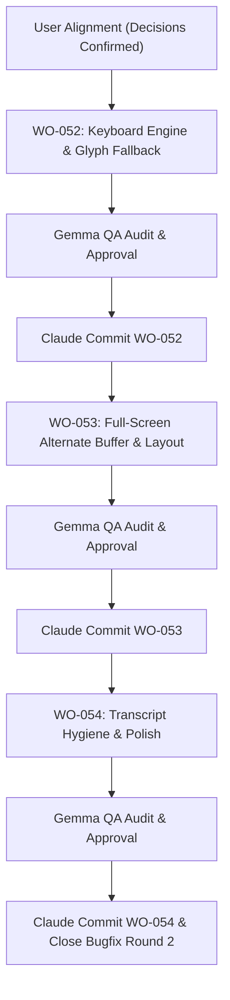

# StackMind TUI — Round 2 Bugfix Implementation Plan

**Target Branch:** `feat/p6-open-source-tui`  
**Reference Document:** `TUI_BUGFIX_2.md`  
**Architectural Baseline:** StackMind v3.3.0 (Commit `b10da20`, WO-051 completed)  
**Governance:** CEO (User) → Claude (Architect) → Codex (Backend Lead) → Gemma (QA)

---

## 1. Executive Summary & User Decisions

Based on live terminal inspection of `clean_demo` and user design alignment, this plan resolves all 7 defects identified in `TUI_BUGFIX_2.md`:

1. **Persistent Runtime Panel via Alternate Screen Buffer (Live Redraw)**:
   - Run in terminal alternate screen buffer (`\x1b[?1049h`).
   - Redraw the two-column workspace on each turn and event, keeping the right-hand runtime panel (`AGENTS`, `WORK ORDERS`, `CURRENT OPERATION`) permanently visible alongside conversation.
2. **Native Raw Keyboard Interception (`msvcrt` & `termios`)**:
   - Implement low-level line editor handling physical `Ctrl+K` (Command Palette) and `Ctrl+L` (Screen Redraw / Clear) without relying on plain `input()`.
3. **Dim System Telemetry & Proper Message Alignment**:
   - Left-align assistant attribution (`✦ StackMind (qwen2.5-coder:7b)`).
   - Render operational telemetry (knowledge revisions, turn submission status) with dim muted styling (`#64748b`) rather than raw body text.
   - Eliminate redundant command bars in the transcript.
4. **Composer State & Dynamic Placeholder**:
   - Hide or replace `Type a message...` placeholder when input text is present in the buffer.
5. **Metadata De-duplication**:
   - Eliminate duplicated full UUIDs between the top header bar and landing block.
6. **Glyph Fallback**:
   - Centralize console glyphs with deterministic ASCII fallbacks for legacy Windows consoles.
7. **Full Terminal Width**:
   - Expand conversation and composer to 100% of terminal width as selected.

---

## 2. Phase Breakdown & Work Order Mapping

We will structure this into three focused, contract-governed Work Orders:

```text
WO-052: Keyboard Engine & Glyph Fallback (Phase 1)
  ├── Raw keyboard line editor (msvcrt / termios)
  ├── Ctrl+K & Ctrl+L real handlers
  ├── Dynamic composer border placeholder toggle
  └── Centralized glyph table with legacy console fallback

WO-053: Full-Screen Alternate Buffer & Layout Anchoring (Phase 2)
  ├── Alternate screen buffer lifecycle (\x1b[?1049h / \x1b[?1049l)
  ├── Redraw engine redrawing two-column layout on turns/events
  ├── Viewport scroll tracking for conversation history
  └── Persistent right-hand runtime panel (AGENTS, WOs, Operation)

WO-054: Transcript Hygiene, Metadata Cleanup & Acceptance (Phase 3)
  ├── Left-aligned model attribution header
  ├── Dim system telemetry styling
  ├── Landing block metadata de-duplication
  └── Full test suite verification & final acceptance
```

---

## 3. Detailed Specifications

### WO-052: Native Keyboard Interception & Glyph Engine

#### 3.1 Raw Keyboard Line Editor (`cli/tui/keyboard.py` & `cli/tui/app.py`)
- **Platform Implementations**:
  - Windows (`os.name == 'nt'`): Use `msvcrt.getwch()` and `msvcrt.kbhit()`.
  - POSIX: Use `termios.tcgetattr`, `tty.setraw`, and `select.select([sys.stdin], ...)`.
- **Key Mappings**:
  - Printable characters: Append to in-memory editing buffer.
  - Backspace (`\x08` or `\x7f`): Delete character before cursor.
  - Enter (`\r` or `\n`): Submit buffer.
  - **`Ctrl+K` (`\x0b`)**: Immediately open command palette / display available colon commands.
  - **`Ctrl+L` (`\x0c`)**: Trigger instant screen redraw / clear.
  - **`Ctrl+C` (`\x03`)**: Cooperative cancellation / exit prompt.
  - Up/Down arrows: Command history recall.
- **Terminal Restoration**:
  - Ensure standard terminal echo and cursor modes are unconditionally restored in `finally:` blocks.

#### 3.2 Dynamic Composer Chrome
- Update `render_composer_box` and `render_composer_top_border`:
  - When buffer is empty: Show `Type a message...`.
  - When buffer is non-empty: Swap to active typing indicator (e.g. `[Active Input]` or simply border without placeholder).

#### 3.3 Centralized Glyph Table (`cli/tui/glyphs.py`)
- Detect console capabilities (`sys.stdout.encoding`, `chcp`, `wt.exe`).
- Provide unified glyph access:
  - Status dots: `●` / `*`
  - Action icons: `⚒` / `[TOOL]`
  - Checkmarks: `✓` / `[OK]`
  - Spinning / running: `↻` / `[RUN]`
  - Disclosures: `▸` / `>` and `▾` / `v`

---

### WO-053: Full-Screen Alternate Buffer & Persistent Layout

#### 3.1 Alternate Screen Lifecycle
- On TUI startup: Emit `\x1b[?1049h` (enter alternate buffer) and `\x1b[2J\x1b[H` (clear screen, home cursor).
- On TUI shutdown: Emit `\x1b[?1049l` (exit alternate buffer, returning terminal to its original state prior to launching `stackmind tui`).

#### 3.2 Full-Screen Redraw Engine
- Compute layout for `term_cols` and `term_lines`:
  - Row 0: Top Header Bar (`stackmind | session | agent | online`).
  - Rows 1 to (Height - 4):
    - Left Column (70–75% width): Conversation Viewport (with vertical scroll offset support).
    - Vertical Divider (`│`).
    - Right Column (25–30% width): Persistent StackMind Runtime Panel (`AGENTS`, `WORK ORDERS`, `CURRENT OPERATION`).
  - Rows (Height - 3) to (Height - 1): Pinned Bottom Composer Box.
- Redraw occurs:
  1. On each keystroke / composer edit.
  2. On each incoming daemon SSE event (updating runtime panel nodes reactively).
  3. On window resize (`SIGWINCH` or terminal size polling).

---

### WO-054: Transcript Hygiene & Metadata De-duplication

#### 4.1 Message Alignment & Styling
- Move model attribution from centered text to inline assistant title:
  - E.g.: `✦ StackMind [dim](qwen2.5-coder:7b)[/dim]` left-aligned at column 0.
- Style operational telemetry lines:
  - `"Knowledge revision: N"`: styled as `dim #64748b`.
  - `"● Thinking... Turn submitted"`: styled as `dim cyan`.
- Remove unneeded stray command menus inserted in the conversation stream.

#### 4.2 Metadata Cleanup
- Top Header: Show short session ID `b49209fd`.
- Landing Block: Only show relative project path and high-level status; eliminate duplicate full UUID strings.
- Remove dead vertical padding inside the landing panel.

---

## 4. Verification & Testing Gate

For each Work Order:
1. `tests/test_tui_*.py` must pass 100%.
2. New unit tests added for raw keyboard parser, alternate buffer lifecycle, and glyph fallback.
3. Schema and system validation (`pytest tests/test_validate.py`) must pass 100%.
4. Gemma audits diff against Contract boundary before approval.

---

## 5. Execution Workflow


