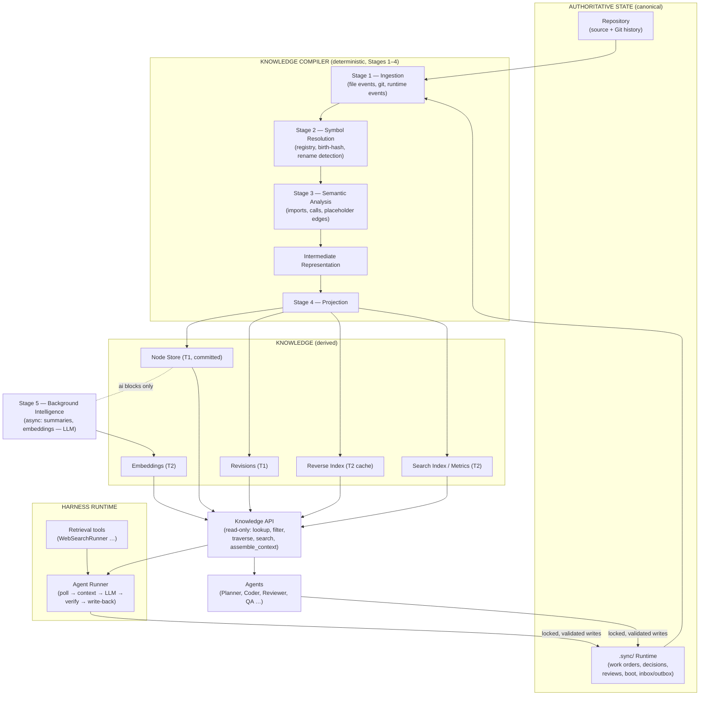
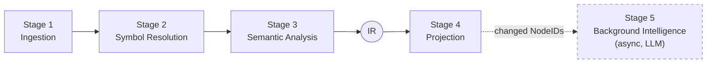
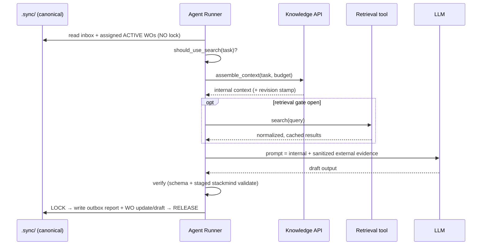
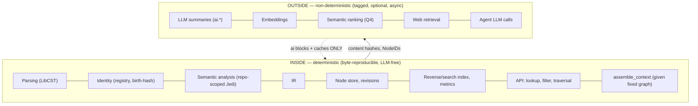
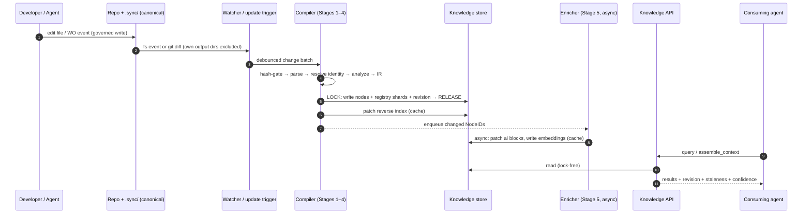
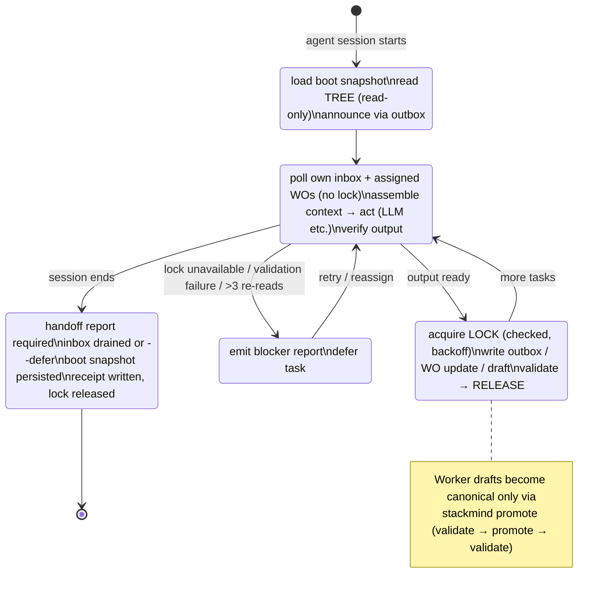
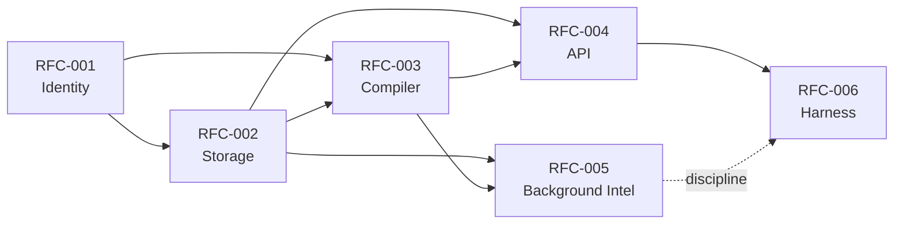
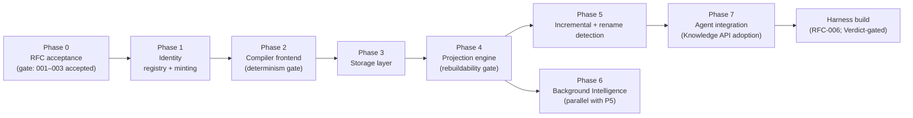
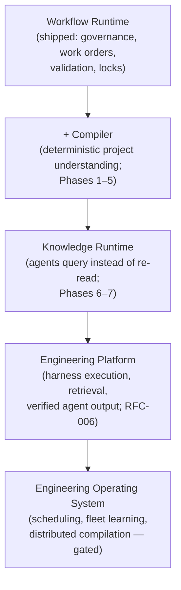

# StackMind Architecture Handbook

**Title:** StackMind — Architecture of a Compiler-Backed Engineering Runtime
**Version:** 1.0
**Status:** Living document — authoritative architectural reference
**Authors:** StackMind Core Architecture (synthesized from the Verdict, SKC Directive, Implementation Plan, RFC-001–006, SMPOC research, and validation reports)
**Last Updated:** 2026-07-16
**Purpose:** The single document every contributor reads before writing code. It replaces the need to read a dozen research artifacts to understand the platform.
**Audience:** Senior engineers, compiler engineers, AI engineers, infrastructure engineers, new contributors, future maintainers, technical architects.
**Reading Time:** ~90 minutes.
**Prerequisites:** Working knowledge of Git, Python, and the general shape of LLM-based agents. No prior StackMind knowledge assumed.

---

## Table of Contents

- [Executive Summary](#executive-summary)
- [1. Introduction](#1-introduction)
- [2. Engineering Philosophy](#2-engineering-philosophy)
- [3. Problem Statement](#3-problem-statement)
- [4. High-Level Architecture](#4-high-level-architecture)
- [5. Three Architectural Pillars](#5-three-architectural-pillars)
- [6. Runtime Governance](#6-runtime-governance)
- [7. Knowledge Compiler (SKC)](#7-knowledge-compiler-skc)
- [8. Symbol Identity](#8-symbol-identity)
- [9. Knowledge Storage](#9-knowledge-storage)
- [10. Knowledge API](#10-knowledge-api)
- [11. Background Intelligence](#11-background-intelligence)
- [12. Harness Runtime](#12-harness-runtime)
- [13. The Deterministic Boundary](#13-the-deterministic-boundary)
- [14. Knowledge Lifecycle](#14-knowledge-lifecycle)
- [15. Runtime Lifecycle](#15-runtime-lifecycle)
- [16. Component Deep Dive](#16-component-deep-dive)
- [17. RFC Overview](#17-rfc-overview)
- [18. Design Decisions](#18-design-decisions)
- [19. Security & Governance](#19-security--governance)
- [20. Scalability](#20-scalability)
- [21. AI Strategy](#21-ai-strategy)
- [22. Implementation Roadmap](#22-implementation-roadmap)
- [23. Contributor Guide](#23-contributor-guide)
- [24. Glossary](#24-glossary)
- [25. Future Vision](#25-future-vision)

---

# Executive Summary

StackMind is a **compiler-backed engineering runtime** for multi-agent software development. It solves a specific, expensive problem: every AI agent session today rebuilds its understanding of a project from scratch — re-reading files, re-discovering structure, re-deriving decisions — burning tokens and time on rediscovery instead of reasoning.

StackMind's answer has three pillars:

1. **Runtime Governance.** A Git-tracked, YAML-based runtime (`.sync/`) that coordinates agents through work orders, per-agent inboxes/outboxes, a write lock, a strict authority hierarchy, multi-layer validation, and enforced shutdown semantics. This exists today and is the platform's transactional foundation.

2. **The Knowledge Compiler (SKC).** A deterministic compiler that transforms authoritative project state — source code, `.sync/` runtime artifacts, Git history — into derived, rebuildable **knowledge projections**: a project knowledge graph, a reverse index, a search index, metrics. The compiler is deterministic end to end: same inputs, byte-identical outputs. No LLM participates in compilation.

3. **The Harness Runtime.** The execution layer where agents actually run: it assembles context from the knowledge graph (and optionally from external retrieval such as web search), invokes an LLM, verifies the output against the runtime's schemas and protocols, and writes results back under governance.

The load-bearing design commitments, in one paragraph: the repository, `.sync/`, and Git history are the **only** sources of truth; everything the compiler produces is a derived projection that can be deleted and rebuilt without information loss — with one exception, the **Symbol Registry**, which is canonical because it carries identity continuity (a symbol keeps its permanent NodeID across renames and file moves) that cannot be recomputed from current source. Deterministic facts and AI inference are stored in strictly separated layers; AI output is always tagged with confidence and provenance, is always optional, and never blocks compilation or queries. Agents consume knowledge through a read-only API and never write knowledge files.

The platform's differentiation is deliberately **not** "more agents" or richer orchestration. It is that every agent starts from the same deterministic, compiler-derived understanding of the project instead of rebuilding that understanding independently. The executive assessment (Final Verdict) rated this direction GO with high confidence, conditional on proving two things early: stable symbol identity and compiler determinism. Both are specified to be provable by construction and enforced by CI gates.

This handbook explains why the architecture exists, how the subsystems interact, what invariants every contributor must preserve, and where the platform is heading.

---

# 1. Introduction

## 1.1 What StackMind is

StackMind is a runtime platform that lets multiple AI agents (and the humans supervising them) collaborate on a software project without stepping on each other and without re-learning the project every session. It consists of:

- a **CLI** (`stackmind`) that initializes, validates, migrates, and governs a per-project runtime;
- a **runtime instance** (`.sync/`) inside each project, holding agent state, work orders, messages, decisions, and reviews as Git-tracked YAML;
- a **knowledge subsystem** (`.sync/knowledge/`) produced by the Knowledge Compiler, holding a queryable graph of the project's code and runtime artifacts;
- a **harness** in which agent processes execute: context in, verified output back.

The engine (this repository) is separable from the instance (the `.sync/` tree that `stackmind init` creates in any project). One engine version serves many project instances; a migration system upgrades instances across engine versions.

## 1.2 What StackMind is not

- **Not a chatbot or an agent.** StackMind contains no built-in LLM. It is the substrate agents run on.
- **Not an orchestration framework.** It does not schedule agents, route conversations, or manage swarms. Deliberately: the Verdict identified "chasing orchestration instead of differentiation" as the primary product risk. Scheduling and UI layers are explicitly gated behind proven value of the knowledge layer.
- **Not a knowledge graph product.** The Project Knowledge Graph is *one projection* of the compiler, not the system itself. StackMind is evolving into a compiler-backed runtime, not "a graph database with extra steps."
- **Not a second source of truth.** Every knowledge artifact is derived. If `.sync/knowledge/` is deleted, the compiler rebuilds it. The runtime and repository remain authoritative, always.

## 1.3 Motivation

Multi-agent engineering fails today in predictable ways: agents lose context at window boundaries, duplicate each other's work, overwrite shared state, drop tasks at handoff, and — most expensively — spend the first significant fraction of every session rediscovering the codebase. StackMind's governance layer already solved the coordination failures (locks, work orders, validated handoffs). The Knowledge Compiler and Harness Runtime address the remaining failure: **understanding does not persist.**

## 1.4 Vision

> The runtime governs execution. The compiler governs understanding.

StackMind evolves from a YAML-based workflow coordinator into an **engineering operating system**: deterministic project intelligence, persistent engineering memory, efficient multi-agent collaboration, rebuildable knowledge projections, and a foundation for retrieval-augmented engineering work — with governance underneath all of it.

## 1.5 Scope, goals, non-goals

**Goals**

- Capture code entities and runtime artifacts in one queryable, incrementally-maintained knowledge store.
- Give every agent the same deterministic starting understanding, via a read-only API.
- Keep the deterministic and AI-inferred layers separate, tagged, and independently trustworthy.
- Make every derived artifact rebuildable; make every build reproducible.
- Keep the platform additive: no existing command or protocol changes to adopt new subsystems.

**Non-goals (current horizon)**

- Heavy external infrastructure: no graph database, no managed vector store, no message broker. JSON files and local caches, by design (see §18).
- Multi-language compilation. Python first; the parser interface is pluggable but only one frontend is built.
- A query language. Four API primitives plus context assembly cover agent use cases.
- Orchestration, scheduling, and TUI — deferred until the Knowledge API demonstrates adoption.

---

# 2. Engineering Philosophy

Ten principles govern every design decision in this codebase. They are not aspirations; each is enforced by a specific mechanism named below, and several are verified mechanically in CI. When a proposed change conflicts with one of these, the change is wrong until proven otherwise.

## 2.1 Git is authoritative

The repository — source code plus Git history — is ground truth for what the software *is*. Nothing derived may contradict it, and nothing derived is trusted over it. Provenance chains (revision records embedding commit SHAs) tie every knowledge artifact back to the exact repository state that produced it.

## 2.2 `.sync/` is the canonical runtime

Everything the agents collectively *know they decided* — work orders, decisions, reviews, boot snapshots, receipts — lives as Git-tracked YAML under `.sync/`, schema-validated and write-serialized. It is the transactional record of the engineering process, exactly as the repository is the record of the engineering product.

## 2.3 Knowledge is derived

The knowledge store is a **projection** of the two canonical sources above. It is never written by agents, never edited by hand, and never consulted as authority when it disagrees with source or runtime. The one nuanced exception — the Symbol Registry — is canonical *state about identity*, not knowledge content (§8).

## 2.4 Determinism before intelligence

Every deterministic stage must produce identical output given identical inputs (repository state, `.sync/` state, registry, compiler version). LLMs never participate in deterministic compilation. This is Principle Zero of the compiler: it is what makes the knowledge trustworthy, diffable, mergeable, and testable. Enforcement: the compile-twice-diff CI gate (§13.4).

## 2.5 Compiler-first architecture

StackMind treats project understanding as a **compilation problem**, not a search problem. Source and runtime state are compiled through a pipeline (parse → resolve identity → analyze → project) into an intermediate representation, from which all knowledge artifacts derive. The consequences — stable identity, incremental rebuilds, reproducibility — fall out of the compiler discipline rather than being bolted on.

## 2.6 Governance before AI

No AI capability bypasses the runtime's authority model, validation layers, or write lock. Agents — including the Harness Runtime's Agent Runner — operate as governed Workers: their writes are locked, validated, attributed, and auditable. An agent that produces invalid state halts rather than persisting it.

## 2.7 Explainability

Every query answer, agent context bundle, and knowledge artifact must be traceable: which graph revision, which Git commit, which model (if AI-touched), what confidence. "The system said so" is never an acceptable provenance chain.

## 2.8 Rebuildability

Deleting every derived artifact must never destroy project state. The compiler rebuilds byte-identical committed projections and equivalent caches. The one artifact recovered from version control rather than recomputation is the Symbol Registry — which is precisely why it is Git-tracked canonical state.

## 2.9 Incrementality

One file changed means only affected symbols recompile. Content hashing detects real change; the dependency structure (including the reverse index) computes the affected set precisely. Full rebuilds exist for recovery, not for routine operation.

## 2.10 Extensibility by addition

New subsystems arrive as new modules, new CLI subcommands, new directories — never as modifications to existing commands or protocols. The knowledge subsystem adds a `graph` command group beside the existing seven commands; the Agent Runner registers as a new agent. This keeps adoption reversible and blast radii small.

> **Callout — the two-sentence version of the philosophy:**
> *Authoritative state is Git-tracked and governed; everything else is a deterministic, rebuildable projection of it. AI adds tagged, optional, confidence-scored annotation on top — never structure underneath.*

---

# 3. Problem Statement

## 3.1 Agents rebuild understanding every session

An LLM agent assigned a task in an unfamiliar-to-this-session repository does the same thing every time: list directories, open files, grep for symbols, read call sites, reconstruct the mental model — then finally start the task. The model's context window is the only place this understanding lives, and it evaporates when the session ends. The next session, or the next agent, pays the full cost again.

## 3.2 Context fragmentation

In a multi-agent system the problem compounds. The Planner's understanding, the Coder's understanding, and the Reviewer's understanding are three independently-derived, mutually-inconsistent reconstructions. A Reviewer's finding ("potential null dereference in `route_query`") lives in a review file; the Coder rediscovers it — or doesn't. Work orders reference deliverable paths; nothing links them to the functions that implement them. Code knowledge and process knowledge are stored in disconnected silos, joined only by whichever agent happens to read both.

## 3.3 Token waste

Rediscovery is the single largest avoidable token cost in agentic engineering. Every `ls`, every file read that ends in "not relevant," every re-derivation of "what calls this function" is context-window budget spent on facts that were already known — by a previous session, by another agent, or by a static analyzer that could have computed them once. Measured harness research on retrieval-augmented agents shows naive context injection can balloon inputs by an order of magnitude; *structured* context — distilled, ranked, budgeted — is dramatically cheaper than raw file dumps.

## 3.4 Repository rediscovery limits what agents can be

The deeper cost is qualitative. An agent that spends its budget on rediscovery reasons shallowly. Cross-file impact analysis ("what breaks if I change this signature?"), historical rationale ("why PostgreSQL?"), and process context ("is there an open review touching this module?") are exactly the questions senior engineers ask and agents currently cannot afford to. Persistent, queryable, trustworthy project knowledge is the difference between an agent that edits files and an agent that engineers.

## 3.5 Why existing tools don't solve it

Code-graph tools (Graphify-class) index code but not process: no work orders, no decisions, no agent state, no incremental maintenance, no governance. Vector-RAG over a repo retrieves fuzzily but cannot answer relational questions ("callers of X") and offers no determinism or provenance. Neither integrates with a governed multi-agent runtime. StackMind's compiler is designed as **layer 2**: full project memory — code *and* process — maintained incrementally under the same governance as everything else.

---

# 4. High-Level Architecture

## 4.1 Master diagram



## 4.2 Reading the diagram

**Repository + `.sync/` (top).** The only authoritative state. Arrows flow *out* of this tier into the compiler and *back into it* only through governed writes (locked, validated, attributed). No arrow ever flows from knowledge back into authority.

**Knowledge Compiler (middle).** A five-stage pipeline. Stages 1–4 are deterministic and LLM-free: ingest change events, resolve every symbol to a permanent identity, extract relationships, materialize projections. Stage 5 runs asynchronously and only annotates.

**Knowledge (derived tier).** Sharded JSON files. The committed node store and revision log are byte-deterministic compiler output; the reverse index, search index, metrics, and embeddings are rebuildable local caches.

**Knowledge API.** The single read-only surface through which anything consumes knowledge. Every response is stamped with the graph revision and Git commit that produced it.

**Harness Runtime.** Where agents execute. The Agent Runner assembles internal context from the API, optionally merges external retrieval, invokes an LLM, verifies output against schemas and protocol, and writes back to `.sync/` under lock — as a governed Worker agent.

**Agents.** Consumers of the API and citizens of the governance model. They read knowledge; they never write it.

## 4.3 The one-way flow

The defining property of the architecture is that information flows one way around a loop:

```
authority  →  compiler  →  knowledge  →  API  →  agents  →  (governed writes)  →  authority
```

Agents influence knowledge only by changing authoritative state (code, work orders, reviews) through governed writes; the compiler then re-derives. There is no shortcut where an agent "fixes" the graph directly. This single constraint is what keeps the knowledge trustworthy: it can be wrong only if the compiler is wrong, and the compiler is deterministic and testable.

<!-- HANDBOOK-CONTINUES -->

---

# 5. Three Architectural Pillars

The Final Verdict fixed StackMind's evolution around three pillars. They are separable concerns with clean interfaces, built and proven in order.

| Pillar | Question it answers | Status |
|---|---|---|
| **Runtime Governance** | *Who may do what, when, and how is it recorded?* | Shipped (v1.2.0) — the existing CLI and `.sync/` protocol |
| **Knowledge Compiler** | *What is true about this project, cheaply and reliably?* | Specified (RFC-001–005), pre-implementation |
| **Harness Runtime** | *How does an agent actually execute a task well?* | Specified (RFC-006), gated behind Knowledge API adoption |

The dependency direction matters: governance requires neither of the others; the compiler requires governance (its writes are locked and validated); the harness requires both (it executes under governance and assembles context from knowledge). Each pillar is useful without the ones above it — a deliberate de-risking of the roadmap.

A useful mental model: **governance is the kernel, the compiler is the filesystem-plus-index, the harness is userspace.** Chapters 6, 7–11, and 12 cover the pillars in that order.

---

# 6. Runtime Governance

Runtime Governance is the shipped foundation: everything else in this handbook is built to its rules, so contributors must internalize it first.

## 6.1 Purpose

Serialize and validate all changes to shared agent state, so that concurrent sessions across multiple agents (and multiple days) cannot corrupt, overwrite, or silently lose work.

## 6.2 The authority hierarchy

```
CEO (human custodian)
  └── Claude   — Senior Architect: sole writer of canonical state
        └── Gemma — QA Lead: review and quality gates
              └── Workers — Codex, Gemini, local-llm, agent runners…
```

Authority is enforced, not advisory:

- **Only Claude writes canonical state** — `runtime/TREE.yaml` (the team-state index) and `runtime/boot/` (canonical agent snapshots). This is the CLAUDE-01 invariant.
- **Workers write drafts** (`runtime/drafts/<agent>.boot.draft.yaml`) and their own outbox. Drafts become canonical only through `stackmind promote`, which validates the draft *before* promotion and the canonical result *after* — a gated two-sided check that records a NORMALIZATION decision on success and files a blocker into Claude's inbox on failure.
- **No agent touches another agent's files.** Each agent reads its own inbox (`inbox/<agent>/`), writes its own outbox, and is forbidden from scanning others' inboxes.

## 6.3 Work Orders

Work orders are the unit of task management: YAML files in `work-orders/ACTIVE/`, `BLOCKED/`, or `COMPLETED/`, indexed by `INDEX.yaml`. Actionable types (FEATURE, BUGFIX, HOTFIX, REFACTOR, FIX) must declare a `deliverable` (type, path, description); planning types (PHASE, RESEARCH, AUDIT, VALIDATION) need not. The ledger (`INDEX.yaml`) is external ground truth: validation flags any drift between it and `TREE.yaml` totals ("canonical drift").

## 6.4 The write lock

`.sync/runtime/LOCK` serializes all canonical writes. `stackmind lock acquire <agent> --session-id N` takes it; `release` frees it; `status` inspects it. Rules every subsystem obeys:

- **Lock only around writes.** Reads of Git-backed YAML never require it. Compute (parsing, LLM calls) happens outside it.
- **Check the acquire.** A failed acquisition means back off and retry or defer with a blocker — never proceed to write. (This was the single most dangerous defect found in early harness sketches; it is now an explicit acceptance test.)
- **Stealing is exceptional.** `--force` writes a `LOCK_STOLEN` receipt for audit and is reserved for human intervention, never automated paths.

## 6.5 Validation — the four layers

`stackmind validate` runs four layers on every invocation; the knowledge subsystem adds a fifth (§9.6):

| Layer | Checks |
|---|---|
| 1 — Schema | YAML syntax; JSON-Schema (Draft-7) conformance of every runtime file |
| 2 — Structure | Required directories and files exist; Git repos intact |
| 3 — Protocol | Authority rules, forbidden actions, protocol-digest hash integrity, review bundling, deliverable requirements, lock well-formedness |
| 4 — Boot Integrity | Snapshot/version alignment, canonical drift (TREE vs INDEX), snapshot version lag, `.sync-ref` anchoring of the `.sync` repo to the main repo |

The philosophy: **agents can pass their own local checks while being silently wrong about shared state** — the layers exist to catch exactly that class of failure from the outside.

## 6.6 Sessions, shutdown, receipts

A session is an agent's bounded working period, anchored by its boot snapshot (state loaded at start) and closed by `stackmind shutdown <agent>`. Shutdown is a gate, not a courtesy:

- a **handoff report** must exist in the outbox;
- the agent's **inbox must be drained** — every message moved to `_read/` (the GEMMA-02 rule). Unprocessed items block shutdown; `--defer` moves them to `_deferred/` explicitly rather than losing them; `--force` bypasses (audited, discouraged);
- a fresh boot snapshot is persisted for session continuity;
- the write lock is released;
- a **receipt** is written to `runtime/receipts/` — the durable record that the session ended cleanly.

## 6.7 Boot snapshots

Boot snapshots (`runtime/boot/<agent>.boot.yaml`) carry an agent's working state across context-window resets — the original answer to "sessions forget." Validation flags a snapshot lagging `TREE.yaml` by more than three versions (broken continuity). The Knowledge Compiler does not replace snapshots; it complements them — snapshots persist *an agent's* state, the graph persists *the project's* state.

## 6.8 Governance philosophy

Three ideas run through every mechanism above:

1. **Verification over trust.** Handoffs, promotions, and shutdowns are validated, not assumed.
2. **Explicit over implicit.** Deferral (`_deferred/`) instead of silent drops; receipts instead of assumed exits; blockers instead of swallowed failures.
3. **Audit everything irregular.** Lock steals, forced shutdowns, failed promotions — each leaves a permanent, attributable record.

**Failure modes and containment:** a crashed agent leaves a held lock (visible in `lock status`, recoverable by forced release with audit); a malformed write is caught at the validation layer nearest to it; canonical drift is caught by Layer 4 even when each individual file is schema-valid.

**Trade-off accepted:** a single global write lock serializes canonical writes and caps write concurrency. At the current scale (a handful of agents, writes measured in files-per-minute) this is the right trade; §20 discusses the evolution path if it ever is not.

---

# 7. Knowledge Compiler (SKC)

## 7.1 Purpose

Transform authoritative project state into derived knowledge projections, deterministically and incrementally. The compiler is the second pillar and the platform's center of gravity: everything "smart" in StackMind rests on the dumb, reliable facts this pipeline produces.

## 7.2 The pipeline



The deterministic boundary sits after Stage 3's output is projected: **Stages 1–4 are pure, reproducible, LLM-free.** Stage 5 is asynchronous annotation (§11) and can be absent entirely.

### Stage 1 — Ingestion

Two paths converge on one transaction:

- **Code path:** changed source files, discovered by full enumeration (`graph build`), filesystem events via a watcher (`graph watch`), or Git diff (`graph update`). Content hashes gate all downstream work — an mtime change with identical content is a no-op.
- **Runtime path:** `.sync/` lifecycle events (work order / review / decision / issue created, updated, closed) upsert runtime nodes directly — no parsing. These events are consumed only *after* Layer-3 authority validation has passed: the compiler projects governed state; it never launders ungoverned writes into knowledge.

Events carry IDs and are deduplicated and deterministically ordered, so batch interleaving cannot change output. The watcher excludes the compiler's own output directories — the builder must never re-trigger itself.

### Stage 2 — Symbol Resolution

Every parsed definition is resolved to a permanent NodeID through the Symbol Registry: existing symbols reuse their IDs; genuinely new symbols mint birth-hash IDs; vanished-and-reappeared symbols pass through **rename detection** (matching on kind, body hash, owner, signature) which rebinds the existing ID as an alias when confident. Chapter 8 covers identity in depth — it is the compiler's most consequential design area.

### Stage 3 — Semantic Analysis

LibCST-based parsing (full-fidelity, precise locations; `ast` acceptable as fallback) extracts modules, classes, functions, signatures, and per-symbol content hashes. Relationship extraction resolves in tiers:

| Tier | Case | Result |
|---|---|---|
| A | Statically resolvable (intra-file, explicit imports, aliases tracked) | `RESOLVED` edge → target NodeID |
| B | Cross-file, needs inference (Jedi `goto`/`infer`) | `RESOLVED` edge → target NodeID |
| C | Stdlib / third-party / dynamic / genuinely ambiguous | `EXTERNAL` (named, unlinked) or `UNRESOLVED` (placeholder, never dropped) |

The critical rule: **resolution scope is the repository only.** Calls into installed packages are recorded by name as `EXTERNAL`, never resolved to NodeIDs. This is what makes the graph identical across machines with different virtualenvs — the single sharpest determinism requirement in the pipeline. Toolchain versions (LibCST, Jedi) are pinned and folded into the compiler version; a toolchain bump is an audited graph change, not silent drift.

**Two-pass resolution within every build:** pass 1 registers all in-scope symbols (IDs exist); pass 2 resolves edges. Forward references — a call into a file parsed later — resolve cleanly instead of dangling on parse order.

### The Intermediate Representation

The IR is the transient, in-memory canonical form of the project at one revision: symbols (each ID-bearing), edges (source, relation, target-or-null, resolution tier, confidence), and diagnostics. It is a pure function of `(source, .sync, git, registry, compiler_version)`, contains no wall-clock or environment data, and carries no AI fields. Its *persisted* form is the node store — the IR is the contract between "understanding" (Stages 1–3) and "writing" (Stage 4), and the unit the determinism gate compares.

### Stage 4 — Projection

Serializes the IR to the node store (canonical JSON: sorted keys, sorted set-arrays, fixed formatting) and derives the cache-tier projections (reverse index, search index, metrics). Every projector is a pure function that declares its inputs — which is what makes precise incremental invalidation possible.

## 7.3 Incremental compilation

The routine mode. On change:

1. **Dirty detection** — content hash vs. stored hash; unchanged files are skipped entirely.
2. **Affected set = A ∪ B** — (A) symbols defined in dirty files, re-parsed and re-resolved; (B) when a symbol was deleted or renamed, every node with an edge *targeting* it, found via the reverse index. The reverse index is thus a **build-time input**, not merely a query accelerator. A pure body edit touches only A; a signature change may widen B.
3. **Batching** — rapid events debounce; a file saved five times in a second compiles once.
4. **Reverse-index patching** — changed nodes' old inbound contributions removed, new added; no full rebuild.

## 7.4 Revisioning

Every committed batch appends a revision record: monotonic ID, parent link, Git commit, `.sync` ref, compiler/schema/registry versions, node/edge/unresolved counts, timestamp. Revisions are the provenance spine — every API response cites one, so every surprising answer is traceable to the exact input state and toolchain that produced it. There is no HEAD pointer file (a merge chokepoint); HEAD is simply the greatest revision on disk.

## 7.5 Atomicity and failure recovery

- **Compute unlocked; write locked.** All parsing/resolution happens without the lock; the lock wraps only the write batch (registry shards + node files + one revision record), then releases.
- **Atomic files.** Temp-write + rename; a crash never leaves a half-written node or registry shard.
- **Per-file transactional, best-effort.** A parse error in one file yields a diagnostic and *keeps that file's previous nodes*; it never aborts the batch. One malformed file cannot freeze or corrupt the graph.
- **Recovery ladder:** cache lost → rebuild; node store lost → recompile (byte-identical); registry lost → restore from Git. Full loss including registry with no VCS is the honest boundary: the graph rebuilds but rename history re-mints — lossy, never corrupt.

## 7.6 Invariants (compiler)

1. Stages 1–4 are deterministic; the compile-twice-diff gate enforces it.
2. No LLM, network, wall-clock, RNG, PID, or absolute path in any deterministic stage or its output.
3. Resolution never consults the installed environment.
4. Unresolved is a first-class state — edges are flagged, never dropped.
5. The compiler is the only writer of `.sync/knowledge/` (Stage 5 excepted, for `ai` blocks only).

---

# 8. Symbol Identity

Identity is the load-bearing wall of the knowledge subsystem. Edges are ID pairs; embeddings are keyed by ID; provenance chains reference IDs; incremental compilation diffs IDs. If identity is wrong, the storage layer gets rewritten later. It therefore received the first RFC and the most careful analysis in the project.

## 8.1 The two axes

Identity schemes must be scored on two orthogonal properties:

- **Axis 1 — Determinism across independent builds.** Two branches (or a from-scratch rebuild) must assign the same symbol the same NodeID with no coordination — otherwise every Git merge of knowledge conflicts and the same function exists under two IDs.
- **Axis 2 — Stability across renames and moves.** A renamed function or moved file should keep its NodeID — otherwise every refactor is a delete-and-create that breaks edges, discards embeddings, and resets provenance.

Naive schemes each buy one axis: pure content-hash IDs (hash of path+name) are branch-deterministic but change on exactly the refactors that matter; minted surrogate IDs (a registry handing out opaque IDs) are rename-stable but branch-divergent. StackMind's scheme buys both.

## 8.2 Birth-hash minting + evolving registry record

```
NodeID = TYPE "-" first16( SHA256( birth_key ) )
birth_key = "<repo-relative path>:<qualified name>"   — captured at FIRST SIGHTING, then frozen
```

The resolution of the apparent contradiction: **the hash is the minting function, not the identity function.** It runs exactly once, when a symbol is first seen. Any two independent builds that first-see the same `(path, qualname)` mint the identical ID — Axis 1, with no central counter. Thereafter, identity lives in the registry record, not in the current path or name — Axis 2.

Sixteen hex characters (64 bits) makes collisions negligible at repository scale; the full digest is retained for audit. Non-code nodes (WorkOrder, Review, Decision, Issue) bypass minting entirely — they carry natural authored IDs (`WO-431`) that the runtime already guarantees unique.

## 8.3 The Symbol Registry

One record per symbol, sharded on disk (per-symbol files in hash-prefix buckets — never one monolithic file, which would be a merge chokepoint on the highest-churn canonical artifact):

```jsonc
{
  "node_id":   "FUNC-92ab34ef0c1d2e3f",
  "kind":      "Function",
  "birth_key": "src/auth.py:AuthService.login",
  "current":   { "path": "src/services/auth.py", "qualified_name": "AuthService.log_in" },
  "aliases":         ["src/auth.py:AuthService.login"],
  "previous_names":  ["AuthService.login"],
  "owner":  "CLASS-4d5e6f…",
  "status": "active",
  "history": [
    {"rev": 181, "event": "born",    "key": "src/auth.py:AuthService.login"},
    {"rev": 204, "event": "renamed", "from": "login",       "to": "log_in"},
    {"rev": 219, "event": "moved",   "from": "src/auth.py", "to": "src/services/auth.py"}
  ]
}
```

A rename appends an alias and updates `current.qualified_name`; a move updates `current.path`. **The NodeID never changes.** Old names remain resolvable through aliases — including at the API (§10), where a query by a symbol's previous name still finds it.

> **Callout — the registry is canonical, not cache.**
> If the registry provided identity stability but were recomputable, losing it would silently re-mint every since-renamed symbol from *current* keys, and stability would evaporate. It is therefore Git-tracked, write-locked, Layer-5-validated, and migrated — the **only** canonical artifact in `.sync/knowledge/`. Everything else there is derived.

## 8.4 Rename detection: advisory, degrading, never corrupting

Deciding "renamed" versus "deleted and something new created" is a heuristic: within a changeset, vanished birth-keys are matched to appeared birth-keys on kind + body content hash + owner + signature (a pure rename leaves the body identical — the strong signal). The safety analysis that made this acceptable:

- **Correct match** → identity, edges, embeddings, and history all survive the refactor.
- **Missed match** → the old node is marked deleted, a fresh ID is minted, inbound edges become `UNRESOLVED` placeholders. **Lossy** — continuity forgets — and self-healing on the next clean pass.
- **False fusion is impossible by construction:** two genuinely distinct symbols have distinct birth-keys, hence distinct birth-hashes. Distinctness is guaranteed; only *continuity* is heuristic.

The asymmetry is the design: identity may occasionally forget, but it can never lie.

## 8.5 Identity invariants

1. Every `node_id` is unique and verifiably equals the birth-hash of its earliest history entry (catches silent re-minting).
2. Live code nodes and live registry records are in bijection.
3. Aliases and previous keys resolve to at most one live node.
4. History is append-only, monotonic in revision.
5. Registry buckets shard by NodeID prefix — two branches adding different symbols merge without conflict; both renaming the *same* symbol conflict in one small file, which is precisely where a human should adjudicate.

---

# 9. Knowledge Storage

## 9.1 The three-tier model

Every file under `.sync/knowledge/` belongs to exactly one tier. This classification is the storage chapter's core idea; everything else is a consequence.

| Tier | Meaning | Git | Deterministic | Recovery |
|---|---|---|---|---|
| **T0 — Canonical** | Not recomputable from source | tracked | n/a | restore from VCS |
| **T1 — Committed derived** | Deterministic compiler output, committed for reviewable diffs and build-free queries | tracked | byte-identical | recompile |
| **T2 — Local cache** | Rebuildable indexes and ML artifacts | **ignored** | tolerant | rebuild |

| Artifact | Tier | Why |
|---|---|---|
| Symbol Registry | **T0** | identity continuity is not recomputable (§8.3) |
| Node store | **T1** | derived, but committed like a lockfile: reviewable, queryable without a build, drift-proofed by the determinism gate |
| Revisions | **T1** | append-only provenance/audit |
| Reverse index, search index, metrics | **T2** | pure functions of the node store |
| Embeddings | **T2** | disposable ML cache; losing them costs recomputation, nothing more |

## 9.2 Directory layout

```
.sync/knowledge/
├── registry/                 # T0 — sharded symbol records
│   └── 2a/FUNC-2a9f8b17c4d1e0f3.json
├── nodes/                    # T1 — sharded by Type + 2-hex bucket
│   ├── Function/2a/FUNC-2a9f8b17c4d1e0f3.json
│   ├── Class/…   Module/…
│   └── WorkOrder/…  Review/…  Decision/…  Issue/…
├── revisions/                # T1 — one file per revision, no HEAD pointer
│   └── REV-0000000182.json
└── cache/                    # T2 — gitignored
    ├── reverse-index/  search/  metrics/  embeddings/
```

Filenames are NodeIDs: lookup is O(1) path construction. Two-hex bucketing (256 buckets) bounds directory size and localizes both filesystem pressure and merge conflicts; the width is parameterizable for very large repositories.

## 9.3 Node files

Each node carries a deterministic block, its outgoing edges inline, and an `ai` block:

```jsonc
{
  "id": "FUNC-2a9f8b17c4d1e0f3",
  "type": "Function",
  "deterministic": {
    "qualname": "AuthService.login",
    "path": "src/auth.py",
    "signature": "(self, credentials)",
    "location": { "line_start": 45, "line_end": 60 },
    "content_hash": "sha256:af8392e1…",
    "owner": "CLASS-4d5e6f0a1b2c3d4e",
    "edges": { "CALLS": ["FUNC-91b7…", null], "IMPORTS": ["MOD-37a1…"] },
    "unresolved": [ { "relation": "CALLS", "name": "auth.login", "confidence": 0.4 } ]
  },
  "ai": {}          // filled asynchronously by Stage 5; may be empty forever
}
```

Two rules with outsized consequences:

- **No wall-clock in node files.** A `last_updated` field would make the same source compile to different bytes at different times, destroying determinism. All temporal provenance lives in revisions; the sole exception is *inside* `ai` blocks, which are excluded from the determinism comparison.
- **Canonical serialization.** Sorted keys, sorted set-arrays, fixed formatting, repo-relative paths, LF endings. "No real change" produces byte-identical files, which is what makes Git merges of knowledge boring.

## 9.4 Edges: stored at the source, permanent at the target

An edge lives in the file of its **source** node, as a target-NodeID reference under a relation key. Consequences, all load-bearing:

- **Renames rewrite zero edges.** Targets are permanent IDs (§8); a renamed symbol's every inbound edge across the whole graph is untouched.
- **One-symbol edit → one file write.** There is no repo-wide `CALLS.json` to rewrite (an earlier design that a one-line change would have churned in full — rejected).
- **Runtime edges follow the same rule.** `ASSIGNED_TO` lives on the WorkOrder node, `REVIEWS` on the Review node. Uniform across code and process nodes.
- **Inbound queries are not the node store's job.** "Who calls X?" is served by the reverse index — deliberately a cache, because it is a pure inversion of committed data.

## 9.5 Reverse index, sharding, caching, versioning

- **Reverse index (T2):** `NodeID → [{source, relation}…]`, sharded by *target* bucket to mirror the node layout. Rebuildable in one scan; incrementally patched during normal operation; also a build-time input for affected-set computation (§7.3). Without it, impact queries are O(all nodes); with it, O(1) file reads.
- **Caching:** embeddings are cached by content hash — a rebuild or a rename (which preserves NodeID and body) re-embeds nothing.
- **Versioning:** the revision log plus schema-version stamps make knowledge migrations first-class: the same migration machinery that upgrades `.sync/` runtime instances upgrades knowledge layouts.

## 9.6 Layer-5 validation (knowledge)

`stackmind validate` gains a fifth layer covering T0/T1 only (T2 is cache; its correctness story is rebuild, not inspection):

1. Schema conformance of every node, registry record, and revision.
2. NodeID uniqueness; node↔registry bijection; ID-equals-birth-hash verification.
3. Edge targets exist or are explicitly flagged unresolved.
4. Revision chain unbroken and monotonic; referenced commits resolvable.
5. Canonical-form check (a re-serialization is a no-op) — the cheap standing proxy for the full compile-twice CI gate.

<!-- HANDBOOK-CONTINUES-2 -->

---

# 10. Knowledge API

## 10.1 Purpose

The single surface through which anything — agents, the Agent Runner, humans, CI — consumes knowledge. Producer subsystems (compiler, enricher) have exactly one consumer-facing contract to honor, and consumers have exactly one interface to learn.

## 10.2 Why it is read-only

Three reinforcing reasons:

1. **The one-way flow (§4.3).** Agents influence knowledge only by changing authoritative state; the compiler re-derives. A writable API would create the shortcut that makes knowledge untrustworthy.
2. **No authority hole.** Knowledge writes bypass no governance because knowledge writes through the API are impossible *by construction* — the API layer holds no writer handles. This is stronger than a permission check.
3. **No lock contention.** Reads of Git-backed JSON need no serialization; a read-only API never competes with agents for the write lock. Queries are always cheap and never block on anyone.

The single "write" the API may trigger — rebuilding a missing T2 cache — goes through the projection contract, touches only cache, and needs no lock.

## 10.3 The four primitives

There is deliberately no query language (surface area without a consumer, at this scale). Four primitives plus assembly cover the agent use cases:

```python
# Q1 — Lookup (exact; alias-aware)
kg.get("FUNC-2a9f8b17c4d1e0f3")                  # O(1): filename is the ID
kg.find(type="Function", name="login")           # resolves via registry, INCLUDING old names

# Q2 — Filter (attribute scan)
kg.filter(type="WorkOrder", status="ACTIVE")
kg.filter(type="Function", path_prefix="cli/")

# Q3 — Traversal (relational)
kg.out(node_id, relation="CALLS")                # from the node file itself
kg.inbound(node_id, relation="CALLS")            # from the reverse index
kg.path(from_id, to_id, max_hops=6)              # explain: relation path between nodes
kg.impact(node_id, depth=2)                      # transitive inbound closure

# Q4 — Semantic (fuzzy)
kg.search("where do we handle JWT tokens", k=5)  # embeddings, with graceful fallback
```

Q1's alias-awareness is the API-level payoff of §8: a query by a symbol's pre-rename name resolves to the same stable NodeID. Q3's `inbound`/`impact` **require** the reverse index; if the cache is missing the API rebuilds it rather than degrading to a full scan. Q4 degrades gracefully: absent or lagging embeddings (enricher disabled — a fully valid state) fall back to token search over names, signatures, and available summaries, with the response marked `semantic: false`. **Semantic absence never fails a query.**

## 10.4 The response envelope

Every response, no exceptions:

```jsonc
{
  "revision": 182,               // graph revision that served this
  "git_commit": "abc123…",
  "stale": false,                // repo has moved past this revision?
  "semantic": true,              // false when the embedding fallback was used
  "results": [ {
      "id": "FUNC-…", "type": "Function",
      "deterministic": { … },                          // always present
      "ai": { "summary": "…", "confidence": 0.93 },    // possibly {}; possibly stale-flagged
      "provenance": { "matched_by": "name|filter|traversal|embedding" }
  } ]
}
```

Contract rules:

- **Deterministic and AI content are visibly distinct** in every result; callers may request `deterministic_only=True` to strip AI entirely. Confidence is passed through, never hidden — filtering on it is the *caller's* policy.
- **Staleness is flagged, never hidden, never auto-fixed.** The API compares the serving revision's commit against repo HEAD; a mismatch sets `stale: true`. It does not auto-recompile — that hides compile latency inside innocent queries and races the watcher. Serving stale-but-flagged beats blocking.
- **Reproducible even at the fuzzy edge:** semantic ranking ties break deterministically (by NodeID), so identical graph state + identical query ⇒ identical response.

## 10.5 `assemble_context` — the flagship operation

Turns a task into a bounded, prompt-ready context bundle:

```python
kg.assemble_context(task="WO-431", budget_tokens=4000,
                    include=("code", "workorders", "decisions", "reviews"))
```

Deterministic five-step algorithm: **anchor** (resolve the task to seed nodes — the WO, its deliverable's modules, or Q4 hits for free text) → **expand** (bounded traversal: callers/callees a hop or two out, linked decisions/reviews/issues) → **rank** (deterministic signals first — edge distance, WO linkage; semantic similarity second) → **distill** (per node: qualname, signature, `path:line`, confidence-tagged summary — *never raw file dumps*) → **budget** (trim lowest-ranked to fit, reporting `dropped: N` — truncation is never silent).

The output carries the standard envelope, which means **an agent's work product can cite the exact knowledge state it reasoned from** — the property that makes agent output auditable at review time. Boundary note: this is the *internal* half of a prompt; merging external evidence (web retrieval) is the Harness Runtime's job (§12). The API never fetches anything external.

## 10.6 CLI mapping

All under the additive `stackmind graph` group: `query` (Q1/Q2/Q4, `--deterministic-only`, `--json`), `callers`/`impact` (Q3 inbound), `explain` (Q3 path), `context` (assembly), `stats`, `versions`. No-match returns exit 0 with empty results — a no-match is an answer, not an error.

---

# 11. Background Intelligence

## 11.1 Purpose

Everything fuzzy, behind a strict boundary: an asynchronous enricher that annotates nodes with LLM summaries and embedding vectors. It improves knowledge; it never *constitutes* knowledge. Disabled, lagging, or killed mid-run, the platform remains fully functional — an empty `ai` block is a valid steady state, permanently.

## 11.2 What it writes — and the guard

The enricher writes exactly two things: the **`ai` block** of T1 node files and the **T2 embedding cache**. Never `deterministic` blocks, never edges, never the registry. This is enforced mechanically: CI asserts that a Stage-5 run produces **zero diff outside `ai` blocks** — the mechanical proof of the deterministic boundary, not a code-review hope.

## 11.3 The `ai` block contract

```jsonc
"ai": {
  "summary": "Routes questions to the appropriate agent based on topic.",
  "risk": null,
  "confidence": 0.93,
  "enriched_hash": "sha256:af8392e1…",   // deterministic.content_hash AT enrichment time
  "model": "…", "prompt_version": "enrich-v1",
  "enriched_at": "2026-07-16T10:23:45Z"
}
```

- **Self-describing staleness:** `enriched_hash != content_hash` ⇒ the summary describes an older body. The API surfaces this per-result (`ai_stale`), so agents discount outdated summaries instead of trusting them. Nothing "expires" silently.
- **Nothing untraceable:** `ai` present ⇒ model + prompt version present (Layer-5 rule). Prompt template changes bump the version, marking prior enrichments stale-by-version for lazy re-enrichment.
- **Confidence** ∈ [0,1], coarsely calibrated for the POC (e.g., higher for full-body summaries than signature-only ones). The deliverable is the *plumbing* — tag, propagate, let callers filter; calibration refines later.

## 11.4 Queue mechanics, failure, cost

Admission: `ai` empty or `enriched_hash` outdated. Idempotent; rapid changes to one node coalesce to a single job (latest hash wins). Priority favors likely `assemble_context` members: runtime nodes and high-fan-in code nodes (found via the reverse index). Drain target is advisory (minutes, visible in `graph stats`) — lag is a status, never an error.

Failure discipline: per-job isolation (one failure never poisons the queue), exponential backoff then park-with-reason, provider rate limits honored globally, atomic `ai` patches (temp+rename — kill-safe by the same pattern as the compiler). **Cost caps are hard:** a per-day token/call budget; exhaustion pauses the queue and reports. Silent overspend is a defect; silent pause is not.

Caching: embeddings are keyed by content hash. A rebuild re-enriches **zero** unchanged nodes; a rename (NodeID preserved, body unchanged) is a cache hit. The expensive artifact survives exactly the operations that used to destroy it.

## 11.5 Privacy — the resolved question

Body-level summaries require sending the body: pretending otherwise is incoherent, and earlier drafts that claimed both were rejected. The resolution is an explicit, per-project, config-gated mode — recorded in every `ai` block's provenance so audits can verify what was exposed:

| Mode | Leaves the machine | Quality |
|---|---|---|
| `full` | symbol body + signature + docstring | best |
| `signatures` | signature + docstring only | weak but useful |
| `local` | nothing — local models only (Ollama-class) | model-dependent |
| `off` | nothing — enricher disabled | deterministic-only graph |

Regardless of mode: never `.sync/` content beyond the node being enriched, never credentials, secret-pattern redaction before transmission, keys env-only, HTTPS, no secrets in logs.

---

# 12. Harness Runtime

## 12.1 Purpose and naming

The third pillar: the execution layer where an agent actually performs a task. **"Harness Runtime" names the layer; the web-search component is a *retrieval tool* (WebSearchRunner) inside it — never "the harness."** (This terminology ruling ended a three-way collision across the research docs and is binding docset-wide.)

The harness is what distinguishes a governed engineering agent from a bare LLM loop: it assembles context deliberately, verifies output before persisting it, and leaves an audit trail. It is explicitly *not* a scheduler or orchestrator — those remain gated behind proven Knowledge-API adoption (the Verdict's product-risk discipline).

## 12.2 Architecture and the task loop

The Agent Runner is a standalone process registered as a **Worker-level agent**: named in `AGENTS.md`, own inbox/outbox, own agent contract, full protocol citizenship.



Protocol rules the loop obeys — each traceable to a defect found and fixed during spec validation:

- **Reads are lock-free; the lock wraps writes only.** Polling, search, and LLM calls never hold it (holding it across an LLM call would starve every other agent).
- **Lock acquisition is checked.** Failure → bounded backoff → defer the task with a blocker report. The runner *never* falls through to an unlocked write, and never uses `--force` (steals are for humans; they leave `LOCK_STOLEN` receipts).
- **Authority respected:** the runner reads its session number from `TREE.yaml` but never increments it (only Claude writes canonical state); its own session record is its outbox report and shutdown receipt. State changes flow as drafts through promotion, or as updates to WOs it is assigned, under lock. `TREE.yaml` byte-identical after a full runner session is an acceptance test.
- **Loop safety:** more than three consecutive re-reads of the same unprocessed item aborts with a blocker (the GEMMA-02 pattern). Idle polling backs off.
- **Shutdown:** full protocol — finish in-flight work, drain or `--defer` the inbox, write the receipt, release any lock.

## 12.3 Context assembly and retrieval

**Internal:** `assemble_context` from the Knowledge API (§10.5) — deterministic, budgeted, revision-stamped.

**External (gated):** `should_use_search(task)` — keyword-first (freshness terms, market/news/competitor domains, explicit source requests ⇒ search; internal/conceptual questions ⇒ skip). The gate's measured hit rate is a **declared** figure feeding the cost model — an unstated gating fraction was one of the four spec defects, and placeholder pricing is banned from benchmark results.

**Retrieval tools** implement one protocol (`search(query, k) -> [Result]`, normalized `{title, url, snippet, published, provider}`), with per-provider rate-limit awareness, backoff, timeouts, a TTL query cache, and per-task/per-day cost caps. Cap exhaustion degrades to internal-only (flagged), never fails the task. Providers are pluggable (Perplexity, SerpAPI, local); a fallback chain is configured, and every report records which provider actually served.

**Prompt-injection defense:** external snippets are *quoted evidence*, never instructions — instruction-like text and code blocks stripped or neutralized, passages truncated, each snippet explicitly cited (title, URL, date), conflicting sources kept and flagged in an `uncertainty` field. Internal deterministic context is never evicted from the budget in favor of external snippets.

## 12.4 Verification and execution

Before any write-back: (1) the output validates against the relevant schema locally; (2) `stackmind validate` passes on the staged state — on failure the runner rolls back or withholds promotion, emits an error report, and halts that task. **Invalid state never persists silently.** (3) Every report cites the knowledge revision its context came from plus the retrieval metadata — a reviewer can reconstruct exactly what the runner knew.

## 12.5 Observability

Structured JSON events per stage plus a `meta` block on every outbox report: knowledge revision, provider chain, search/cache counts, model, token counts, latency breakdown (poll/search/LLM/write), lock wait+hold, cost estimate, confidence, uncertainty. The baseline-vs-augmented benchmark (accuracy, hallucination rate, latency, tokens, cost — with the gating fraction reported) falls directly out of these logs.

## 12.6 Future tools

The retrieval protocol generalizes: documentation fetchers, issue-tracker readers, internal-wiki retrievers, code-execution sandboxes — each a gated, cached, cost-capped, sanitized tool behind the same interface. The LLM-self-invoking tool-use pattern is deliberately deferred: developer-orchestrated retrieval gives deterministic gating, cost control, and a simpler audit story for the POC; revisit post-benchmark.

---

# 13. The Deterministic Boundary

The single most important line in the architecture. Everything on one side is reproducible fact; everything on the other is tagged inference. The platform's trustworthiness is exactly the integrity of this line.

## 13.1 The line



## 13.2 What may cross, in each direction

**Deterministic → non-deterministic:** everything. Facts feed inference freely.

**Non-deterministic → deterministic: almost nothing.** AI output lands only in `ai` blocks (excluded from determinism comparison) and T2 caches. It may never create or modify a node's deterministic block, an edge, a registry record, or a revision. An LLM that "notices" a relationship may record it as a tagged suggestion inside `ai`; only the compiler, re-deriving from source, may assert it as structure.

## 13.3 Why the line sits here

- **Trust is layered.** Agents must be able to rely on structure absolutely (an edge either exists in the source or it doesn't) while treating annotation as advisory. Mixing the layers poisons both: structure becomes probabilistic, and inference gains unearned authority.
- **Reproducibility is the debugging story.** A wrong deterministic answer is a compiler bug — findable, testable, fixable once. A wrong inference is a model limitation — discountable via confidence. Conflate them and every wrong answer becomes an unfalsifiable shrug.
- **Environment independence is part of determinism.** The subtlest requirement: resolution never consults installed packages (external calls are named, not linked), no wall-clock in deterministic output, toolchain versions pinned into the compiler version. Two machines, two virtualenvs, two days — one graph.

## 13.4 Enforcement (mechanical, not aspirational)

1. **Compile-twice-diff CI gate:** build, snapshot T1, wipe, rebuild, `git diff --exit-code`. Any nondeterminism fails the build.
2. **`ai`-only diff guard:** a Stage-5 run must change nothing outside `ai` blocks.
3. **Layer-5 canonical-form check:** re-serialization of any T0/T1 file is a no-op.
4. **Purity rules in review:** no network, RNG, PID, absolute paths, or wall-clock in Stages 1–4 code paths.

---

# 14. Knowledge Lifecycle

End-to-end: from a developer (or agent) changing authoritative state to an agent consuming updated knowledge.



Timing expectations: deterministic knowledge is current within roughly a second of a change batch (hash-gated, incremental); AI annotation follows within minutes (queue-drained, advisory); queries are always served immediately from whatever state exists, honestly flagged. The lifecycle has no blocking edge anywhere on the read path.

Deletion recovery, one more time, because contributors must know it cold: **T2 lost → rebuild; T1 lost → recompile byte-identical; registry lost → `git restore`.** Nothing in this lifecycle can lose project state.

---

# 15. Runtime Lifecycle

The governance-side lifecycle of an agent session, into which the knowledge lifecycle nests.



The two lifecycles compose cleanly because they share exactly one contact point: **governed writes to `.sync/`**. An agent's write (a completed WO, a review) is simultaneously the end of a runtime-lifecycle step and the start of a knowledge-lifecycle step — the compiler picks it up as a runtime event and projects it, and every other agent's next query sees it. No other coupling exists between the pillars, which is why they can be built, tested, and reasoned about independently.

<!-- HANDBOOK-CONTINUES-3 -->

---

# 16. Component Deep Dive

Reference tables for every subsystem. Format: purpose, interfaces, responsibilities, dependencies, failure modes. Existing components cite their real locations; specified components cite their planned homes.

## 16.1 CLI (`cli/main.py` + command modules)

| | |
|---|---|
| **Purpose** | Single entry point (`stackmind`) for all runtime operations |
| **Interfaces** | Click group; 7 shipped commands (`init`, `validate`, `doctor`, `migrate`, `shutdown`, `promote`, `lock`) + planned `graph` group (`cli/graph.py`) |
| **Responsibilities** | Argument handling, human-readable output (rich), exit codes; delegates logic to per-command modules |
| **Dependencies** | click, rich, jsonschema, PyYAML |
| **Failure modes** | Command failure ⇒ nonzero exit + message; never leaves partial state (delegated modules own atomicity) |

## 16.2 Validator (`cli/validate.py`, future `validators/knowledge/`)

| | |
|---|---|
| **Purpose** | The platform's immune system: four shipped layers + knowledge Layer 5 |
| **Interfaces** | `validate(path, fix=False) → ValidationResult` (issues with layer, severity, auto-fixability); CLI `stackmind validate [--fix]` |
| **Responsibilities** | Schema/structure/protocol/boot checks (§6.5); knowledge invariants (§9.6); auto-fix for minor issues |
| **Dependencies** | Schemas in `schemas/` (Draft-7); Git for `.sync-ref` anchoring |
| **Failure modes** | Detection-only component — its own failure mode is a false pass, mitigated by layered redundancy (drift caught even when files are individually valid) |

## 16.3 Lock manager (`cli/lock.py`)

| | |
|---|---|
| **Purpose** | Serialize canonical writes across all agents and tools |
| **Interfaces** | `acquire_lock / release_lock / read_lock / lock_is_malformed`; CLI `lock acquire/release/status` |
| **Responsibilities** | Lock file lifecycle at `.sync/runtime/LOCK` (holder, session, timestamp); `LOCK_STOLEN` receipts on forced steals |
| **Failure modes** | Stale lock from a crashed holder (visible, force-releasable, audited); malformed lock (flagged by validate); *unchecked acquisition by a caller* — a caller bug, which is why every consumer contract mandates checked acquire with backoff |

## 16.4 Migration engine (`cli/migrate.py`, `migrations/`)

| | |
|---|---|
| **Purpose** | Upgrade runtime instances (and, later, knowledge layouts) across engine versions |
| **Interfaces** | YAML manifests (`from_version`/`to_version`, `up`/`down` action lists); CLI `migrate [--check|--rollback|--to]` |
| **Responsibilities** | Ordered application, rollback, migration log (`MIGRATIONS.yaml`); actions incl. `add_field`, `normalize_enum_field`, `restore_field` with glob targeting |
| **Failure modes** | Partial application ⇒ rollback path; drifted fields normalized losslessly (`preserve_to`) |

## 16.5 Symbol Registry (planned: `validators/knowledge/registry.py` + `.sync/knowledge/registry/`)

| | |
|---|---|
| **Purpose** | Permanent symbol identity (§8) |
| **Interfaces** | `lookup(birth_key) → NodeID`, `mint(kind, path, qualname)`, `rebind(rename)`, `mark_obsolete`; sharded JSON records |
| **Responsibilities** | Birth-hash minting, alias/history tracking, rename rebinding, deletion marking |
| **Dependencies** | Write lock (T0 writes); Layer-5 validation; migration engine |
| **Failure modes** | Missed rename ⇒ lossy re-mint (self-healing, never corrupting); registry loss ⇒ Git restore; shard merge conflict ⇒ localized to one symbol's file |
| **Invariant** | Canonical. Never cache. Never recomputed from current keys. |

## 16.6 Compiler frontend (planned: `validators/knowledge/compiler/{ingest,parse,resolve,ir}.py`)

| | |
|---|---|
| **Purpose** | Deterministic Source + `.sync` → IR (Stages 1–3) |
| **Interfaces** | `compile_full(root) → IR`, `compile_incremental(changeset, prev) → IR-delta`; consumed by the projection stage |
| **Responsibilities** | Hash-gating, LibCST parsing, qualname derivation, two-pass edge resolution (repo-scoped Jedi), placeholder edges, diagnostics |
| **Failure modes** | Per-file parse error ⇒ diagnostic + previous nodes retained; Jedi timeout ⇒ edge downgraded to UNRESOLVED; never batch-fatal |

## 16.7 Projection engine (planned: `validators/knowledge/compiler/project.py`)

| | |
|---|---|
| **Purpose** | IR → node store (T1) + derived caches (T2) |
| **Interfaces** | Projector contract: pure function, declared inputs, writes one artifact class; no projector reads another's T2 output |
| **Responsibilities** | Canonical serialization, atomic locked write batches, revision stamping, reverse-index/search/metrics generation |
| **Failure modes** | Crash mid-batch ⇒ temp+rename means no torn files; T2 corruption ⇒ delete and rebuild |

## 16.8 Enricher (planned: Stage-5 worker)

| | |
|---|---|
| **Purpose** | Async AI annotation (§11) |
| **Interfaces** | Queue of NodeIDs in; `ai` patches + embedding cache out; config: mode (`full/signatures/local/off`), models, budgets |
| **Failure modes** | Per-job isolation; backoff → park; cost-cap pause (reported); kill-safe atomic patches |
| **Invariant** | Zero diff outside `ai` blocks — CI-enforced |

## 16.9 Knowledge API (planned: `stackmind.knowledge` + `cli/graph.py` query commands)

| | |
|---|---|
| **Purpose** | Sole read surface (§10) |
| **Interfaces** | Q1–Q4 + `assemble_context`; CLI mappings; JSON envelope |
| **Failure modes** | Missing T2 ⇒ rebuild-then-serve; stale graph ⇒ flag-and-serve; absent embeddings ⇒ text fallback (`semantic: false`); no-match ⇒ empty results, exit 0 |
| **Invariant** | Read-only by construction; every response revision-stamped |

## 16.10 Agent Runner (planned: harness module; RFC-006)

| | |
|---|---|
| **Purpose** | Governed task execution loop (§12) |
| **Interfaces** | Inbox/WO consumption; Knowledge API; retrieval-tool protocol; outbox/draft writes |
| **Failure modes** | Lock unavailable ⇒ backoff → defer+blocker; validation failure ⇒ rollback+halt task; retrieval cap ⇒ internal-only (flagged); >3 re-reads ⇒ abort+blocker |
| **Invariant** | Worker authority; TREE read-only; writes locked and validated; never writes knowledge |

## 16.11 Retrieval tools (planned: WebSearchRunner et al.)

| | |
|---|---|
| **Purpose** | Gated external evidence (§12.3) |
| **Interfaces** | `search(query, k) → [Result]` normalized; provider chain config |
| **Failure modes** | 429/timeout ⇒ backoff ⇒ provider fallback; budget exhaustion ⇒ pause (flagged); all failures degrade the *quality* of a task, never its protocol safety |

---

# 17. RFC Overview

Six RFCs specify the knowledge and harness pillars. Each is summarized here to orientation depth; read the RFC itself before modifying its subsystem.

### RFC-001 — Identity & Symbol Registry
**Decides:** NodeIDs are birth-hashes (`TYPE-first16(SHA256(path:qualname))` at first sighting, then frozen); the registry is canonical Git-tracked state pinning identity across renames/moves via aliases and history; rename detection is advisory and degrades gracefully (never fuses distinct symbols).
**Why it's first:** every other artifact references NodeIDs; identity errors force storage rewrites. The key insight — identity has two orthogonal axes (build-determinism, rename-stability) and the birth-hash-plus-registry scheme is the only design on the table that buys both.

### RFC-002 — Storage & Projection
**Decides:** the three-tier model (T0 canonical / T1 committed-derived / T2 cache); edges stored in source-node files as permanent-ID references (renames rewrite zero edges); the reverse index as a T2 projection; sharding by type + hash bucket; per-revision provenance files; **no wall-clock in deterministic output**; the compile-twice-diff CI gate.
**Relationship:** consumes RFC-001's immutable-ID constraint; shapes everything RFC-003 writes.

### RFC-003 — Knowledge Compiler
**Decides:** the five-stage pipeline with the deterministic boundary after Stage 3; the IR contract; two-pass resolution (forward references resolve); repo-scoped environment-independent analysis; rename detection scheduled in Stage 2 and tested where it's built; incremental affected-set = dirty symbols ∪ reverse-index inbound of deleted/renamed; compute-unlocked/write-locked atomicity; per-file failure isolation.
**Relationship:** produces what RFC-002 stores; closes the determinism risk the Verdict flagged.

### RFC-004 — Knowledge API
**Decides:** a read-only four-primitive surface (no query language); the provenance envelope (revision, staleness, confidence on every response); flag-don't-block staleness; budgeted deterministic `assemble_context` with visible truncation.
**Relationship:** the consumption contract for RFC-001/002/003 output; the internal-context supplier to RFC-006; gates implementation Phase 7.

### RFC-005 — Background Intelligence
**Decides:** async queue-based enrichment; the `ai`-block contract with `enriched_hash` self-describing staleness; content-hash embedding caching; hard cost caps that pause-and-report; the four-mode privacy policy (`full`/`signatures`/`local`/`off` — resolving the "no raw code to LLMs while summarizing code" incoherence); the CI guard that Stage-5 runs diff nothing outside `ai`.
**Relationship:** the only subsystem allowed across the deterministic boundary, and only into `ai` blocks and caches; improves RFC-004's Q4 without ever being required by it.

### RFC-006 — Harness Runtime
**Decides:** the Agent Runner as a protocol-complete Worker agent (checked locking around writes only; TREE read-only; drafts→promote; GEMMA-02 loop safety; full shutdown semantics); gated pluggable retrieval with declared cost fractions; verification-before-write-back; observability sufficient for the baseline-vs-augmented benchmark; the binding terminology ruling.
**Relationship:** consumes RFC-004 (internal context) and RFC-005's retry/privacy discipline; formalizes the Verdict's third pillar; seeded by the externally-produced harness engineering spec after code-verified validation fixed its four defects (unchecked lock acquire; reads under lock; unstated search-gating fraction; TREE session-counter authority conflict).

**Dependency graph:**



---

# 18. Design Decisions

The decisions contributors most often question, with the reasoning that settled them. Re-litigating these requires new evidence, not new taste.

## 18.1 Why JSON files (and not a database)

Knowledge is stored as sharded JSON in Git because the properties that matter most at this stage are *Git-nativeness*: diffable in review, mergeable across branches, versioned for free, anchored to commits, zero operational footprint. A database adds a server, a backup story, an auth story, and a second source of truth risk — for query performance the platform does not yet need (filename-is-ID gives O(1) lookup; the reverse index gives O(1) inbound). The schema was nonetheless designed to load cleanly into a graph database later: nodes and ID-pair edges translate directly if scale demands it (§20).

## 18.2 Why Git as the substrate

Git is already the project's provenance system, replication system, and audit log. Building knowledge on anything else would mean re-implementing history, blame, merge, and distribution — badly. The `.sync-ref` anchor (main repo records the last-known-good `.sync` commit) extends the same trust chain to runtime state.

## 18.3 Why a compiler (and not an indexer or RAG pipeline)

Because the failure modes of "index + retrieve" are exactly the failure modes StackMind exists to eliminate: nondeterminism, unexplainable answers, no identity across renames, no incrementality guarantees, no merge story. Compiler discipline — stable identity, a defined IR, pure projections, reproducible output — is the only framework that makes *project understanding* testable. The cost (more upfront design: identity, IR, determinism gates) was paid deliberately in the RFC phase.

## 18.4 Why not Neo4j / a graph database

Rejected *for now*, not forever: operational burden (a running server per project), a second store to keep consistent with Git, RBAC/backup complexity, and — decisively — the loss of diffable, mergeable, reviewable knowledge. The three-tier layout is deliberately DB-loadable when a repository outgrows files.

## 18.5 Why not SQL

Relational storage models neither the graph shape (recursive traversals) nor the Git-native workflow. SQLite as a *cache* backend for T2 indexes remains an open, low-stakes option — caches are rebuildable, so the choice is reversible.

## 18.6 Why not a managed vector database

Embeddings are a **cache** (Tier 2, gitignored, disposable). A managed vector store (external service, API keys, egress, cost) for disposable data inverts the criticality relationship. Local storage suffices at repo scale; Qdrant-class self-hosted options slot in behind the same cache interface if needed.

## 18.7 Why not orchestration-first

The Verdict's sharpest product judgment: StackMind's advantage is not more agents, it is shared deterministic understanding. Orchestrators are plentiful and converging; a compiler-backed project brain under governance is differentiated. Scheduler and TUI are therefore *sequenced last and gated* on demonstrated Knowledge-API adoption — the roadmap resists its own most tempting scope creep.

## 18.8 Why additive architecture

Every subsystem lands as new modules and new commands beside the shipped seven. Benefits compound: adoption is reversible (delete `.sync/knowledge/`, remove the command group, nothing else notices), reviews stay bounded, the blast radius of a defect is the new subsystem, and the platform's own governance (validation of the new artifacts) extends naturally rather than being refactored.

## 18.9 Why the registry is the one canonical exception

Everything derived should be rebuildable — except identity continuity, which is *information about the past* (what was renamed to what) that current source simply does not contain. The choice was: give up rename stability (unacceptable — §8.1), or admit one small, sharded, validated, Git-tracked canonical artifact. The exception is narrow, explicit, and guarded by its own invariants.

---

# 19. Security & Governance

Security in StackMind is mostly *governance rigorously applied*; this chapter collects the enforcement points in one place.

## 19.1 Authority enforcement

The hierarchy (§6.2) is checked, not trusted: Layer-3 validation detects forbidden actions; promotion is the only path from worker draft to canonical state and validates on both sides; the knowledge subsystem inherits all of it by consuming only post-validation runtime events. The Agent Runner holds Worker authority — architecturally incapable of canonical writes rather than merely instructed to avoid them.

## 19.2 Locking and audit

One write lock, checked acquisition, writes-only hold windows, forced steals receipted (`LOCK_STOLEN`), malformed locks flagged. Every irregular event — steal, forced shutdown, failed promotion, deferred inbox — leaves an attributable, permanent record. The audit posture: *normal operation is quiet; every exception is loud and durable.*

## 19.3 Protocol integrity

`PROTOCOL_DIGEST.md` is hash-verified (`PROTOCOL_DIGEST.hash`) on every validation — the protocol rules themselves cannot drift silently. Shutdown gates (handoff + drained inbox + receipt) make session ends verifiable. `.sync-ref` anchors the runtime repo to the main repo, so a tampered or rolled-back `.sync` is detectable from the outside.

## 19.4 AI-boundary security

- **Egress control:** the four-mode privacy policy (§11.5) is the single knob governing what source leaves the machine; the active mode is recorded in every `ai` block for audit. Secret-pattern redaction runs regardless of mode. Deterministic stages transmit nothing, ever.
- **Ingress control (prompt injection):** external retrieval is untrusted input. Snippets are sanitized, quoted as evidence with citations, never allowed to act as instructions; internal context is never evicted by external content. RAG-agent injection studies motivated making this a spec-level requirement rather than an implementation nicety.
- **Credentials:** environment-only, never in code, config, logs, or `.sync/`. HTTPS everywhere.
- **Validation as the last line:** whatever an AI-assisted path produces, it persists only if the staged state passes `stackmind validate`. A compromised or confused agent writes nothing invalid *silently*.

## 19.5 Trust summary

| Data class | Trust basis |
|---|---|
| Source, Git history | authoritative |
| `.sync/` runtime YAML | authoritative (schema-validated, authority-gated, locked) |
| Registry | canonical (validated, locked, Git history) |
| Node store deterministic blocks | derived fact — trust equals compiler correctness (CI-gated) |
| `ai` blocks, embeddings | advisory — confidence-tagged, staleness-tagged, optional |
| External retrieval | untrusted input — sanitized, quoted, cited |

---

# 20. Scalability

## 20.1 Current envelope

The file-based design is sized for repositories in the tens-of-thousands-of-symbols range: 2-hex bucketing keeps directories at ~40 files per bucket at 10k functions; filename-is-ID keeps lookup O(1); the reverse index keeps inbound queries O(1); hash-gating keeps routine compilation proportional to the change, not the repo.

## 20.2 What scales already

- **Incremental compilation** is the primary lever: cost tracks churn, not size. Full rebuilds are recovery events.
- **Caching:** embedding reuse by content hash; retrieval query cache; T2 rebuild-on-demand.
- **Bucket width** is parameterizable (3-hex = 4096 buckets) before any structural change is needed.

## 20.3 Known ceilings and their designed exits

| Ceiling | Signal | Exit (designed, not yet needed) |
|---|---|---|
| Git churn on committed T1 at very high commit velocity | slow status/merge on knowledge paths | demote node store to T2-with-snapshot, or DB backend |
| File-per-node at 10⁶ symbols | filesystem inode pressure | pack formats or embedded store (SQLite/LevelDB) behind the same projector contract |
| Single write lock | measured lock-wait dominating agent latency | scope-split locks (runtime vs knowledge), then per-shard locking |
| In-process query on huge graphs | assemble_context latency | load T1 into a real graph DB — the schema (nodes + ID-pair edges) was shaped for exactly this import |
| Jedi resolution cost on cold large repos | Stage-3 wall time | resolution cache keyed by (content-hash, compiler-version); parallel parse (already order-independent by design) |

## 20.4 Toward a distributed compiler

Nothing in the pipeline requires locality: parsing is per-file pure, resolution is two-pass over declared inputs, projection is pure per-artifact. A future distributed build (shard the parse fan-out, gather at Pass 2, single writer for the locked batch) is a scheduling exercise, not a redesign — the determinism discipline that makes CI gates possible is the same property that makes distribution safe.

<!-- HANDBOOK-CONTINUES-4 -->

---

# 21. AI Strategy

## 21.1 The stance

StackMind is AI-*hosting*, not AI-*dependent*. Every AI capability is optional, tagged, budgeted, and replaceable; every deterministic capability works with AI fully disabled. This is a strategy, not a limitation: it means model churn (better models, cheaper models, local models) improves the platform without destabilizing it, because no structural decision depends on any model's behavior.

## 21.2 Current capabilities (specified)

| Capability | Where | Discipline |
|---|---|---|
| Node summaries, purpose, risk notes | Stage 5 enricher → `ai` blocks | confidence + staleness tagged; four-mode privacy; cost-capped |
| Embeddings for semantic search | Stage 5 → T2 cache | content-hash cached; disposable |
| Semantic query (Q4) | Knowledge API | deterministic re-ranking, text fallback, `semantic` flag |
| Task execution | Harness Agent Runner | governed Worker; verification before write-back |
| External retrieval | WebSearchRunner | gated, sanitized, cached, cost-capped |

## 21.3 Local vs. cloud models

The privacy-mode table (§11.5) doubles as the deployment spectrum: `full`/`signatures` with hosted models where source egress is acceptable; `local` (Ollama-class) where it is not; `off` for deterministic-only operation. Model identity and prompt version are recorded per annotation, so mixed fleets (cheap model for summaries, strong model for agent reasoning) remain auditable. Nothing in the architecture privileges any provider; clients are thin and swappable.

## 21.4 Future capabilities — each gated on the layer below it

1. **Better retrieval-augmented engineering:** internal (graph) + external (web/docs/issues) context converging in `assemble_context`-plus-harness merging — measured by the baseline-vs-augmented benchmark before expansion.
2. **AI-suggested structure, deterministically confirmed:** models may propose relationships ("these modules look coupled") as tagged `ai` suggestions; promotion into deterministic edges happens only when the compiler can verify from source. The boundary never softens; the *pipeline into it* gets smarter.
3. **Reasoning over the graph:** multi-hop questions ("why does auth depend on the migration engine?") answered by traversal-guided LLM reasoning, with each hop cited to deterministic edges — explainable-by-construction reasoning rather than free association.
4. **Fleet-level learning:** review findings and decision rationale, already first-class nodes, become training/evaluation context for agents — the runtime's own history as curriculum.

## 21.5 What stays out

No AI in Stages 1–4, ever (§13). No self-modifying knowledge. No agent-writable graph. No unaudited model output in any canonical or committed tier. The strategy's one-line summary: **AI proposes, the compiler disposes.**

---

# 22. Implementation Roadmap

The Implementation Plan (docs/SMPOC/SKC-IMPLEMENTATION-PLAN.md) is the authoritative sequencing document; this is the orientation view.



Principles that govern the roadmap (the phases inherit them; the plan details them):

- **Nothing merges before Phase 0 closes** — RFC acceptance is a hard gate, currently open (all six RFCs are written; acceptance is not yet recorded).
- **Every phase has a binary acceptance gate**, mapped to the Directive's definition of done: determinism proven in P2 (compile-twice), rebuildability proven in P4 (delete-projections-recompile-identical), identity stability proven where detection is built (P5 — rename/move tests live with the code that earns them, a lesson from an earlier plan that asserted the test three phases before the mechanism).
- **Validation ships with features:** each phase lands its schemas and Layer-5 checks in the same change as the artifacts they guard.
- **The Harness build is sequenced after Phase 7** and gated on demonstrated Knowledge-API adoption — the anti-orchestration-creep discipline applied to the roadmap itself.

Current status: pre-implementation. The planning phase is complete (all RFCs written, all known spec defects fixed); implementation authorization is a separate, explicit decision.

---

# 23. Contributor Guide

## 23.1 Reading order

1. **This handbook, start to finish.** It exists so you don't have to read twelve documents to be dangerous.
2. **The RFC for your subsystem** before modifying it: identity → RFC-001; storage → RFC-002; compiler → RFC-003; API → RFC-004; enrichment → RFC-005; harness → RFC-006.
3. **`docs/protocols.md` and `docs/architecture.md`** for shipped-runtime specifics; **`docs/SMPOC/SKC-IMPLEMENTATION-PLAN.md`** for phase gates; **`docs/SKC-STATUS.md`** for current planning state.
4. The research lineage (`docs/SMPOC/`) only when you need to know *why a rejected alternative was rejected* — the verdict, POC evolution, and validation reports live there.

## 23.2 Codebase map

```
stackmind/
├── cli/                    # shipped commands; graph.py lands here (additive)
│   ├── main.py             #   click group — command registration only
│   ├── validate.py         #   the four layers (+ Layer 5 integration point)
│   ├── lock.py  promote.py  shutdown.py  migrate.py  init.py  doctor.py
├── schemas/                # Draft-7 JSON Schemas (+ knowledge/ subdir planned)
├── validators/             # currently empty; planned home of knowledge/ modules
├── templates/sync/         # the .sync/ skeleton `stackmind init` instantiates
├── migrations/             # version-to-version YAML manifests
├── tests/
└── docs/
    ├── STACKMIND_ARCHITECTURE.md   # this handbook
    ├── rfcs/RFC-001…006
    └── SMPOC/                      # research lineage (gitignored planning docs)
```

## 23.3 Onboarding checklist

- Run `stackmind init` on a scratch directory; read the `.sync/` tree it produces.
- Run `stackmind validate` and `doctor` against it; break something and validate again.
- Walk one full governance cycle by hand: lock acquire → edit a work order → validate → lock release → shutdown (watch the inbox-drain gate refuse you, then `--defer`).
- Read one RFC end-to-end (RFC-001 is the shortest path to understanding why everything else is shaped as it is).

## 23.4 Rules that will be enforced on your PRs

1. **Never break an invariant** in §2, §7.6, §8.5, or §13 — reviewers check these first.
2. **Additive changes only** to shipped surfaces; new capability = new module + new subcommand.
3. **Determinism hygiene** in anything Stages 1–4: no wall-clock, network, RNG, environment reads; canonical serialization for T0/T1 writes.
4. **Locks:** checked acquisition, writes-only hold, always released.
5. **Schema + Layer-5 checks travel with new artifacts** — a feature without its validator is half a feature.
6. **AI output goes only where AI output goes:** `ai` blocks and T2, tagged with model/prompt/confidence.

---

# 24. Glossary

| Term | Definition |
|---|---|
| **Agent** | An LLM-backed (or human) actor with an identity in `AGENTS.md`, an inbox/outbox, and a place in the authority hierarchy |
| **Agent Runner** | The Harness Runtime's execution loop: poll → context → LLM → verify → governed write-back (RFC-006) |
| **`ai` block** | The tagged, optional, confidence-scored annotation section of a node — the only node content AI may write |
| **Birth key / birth hash** | A symbol's `path:qualname` at first sighting; its SHA-256 mints the permanent NodeID |
| **Canonical** | State that cannot be recomputed: repository, `.sync/` runtime, Git history, and the Symbol Registry |
| **Compiler (SKC)** | The deterministic five-stage pipeline transforming canonical state into knowledge projections |
| **Context (assembled)** | A bounded, ranked, revision-stamped bundle of project knowledge produced by `assemble_context` for an agent prompt |
| **Deterministic boundary** | The line after Stage 4: inside, byte-reproducible and LLM-free; outside, tagged inference (§13) |
| **Edge** | A typed, directed relation between two NodeIDs, stored in the source node's file; `RESOLVED`, `EXTERNAL`, or `UNRESOLVED` |
| **Harness (Runtime)** | The execution layer (pillar 3) — never the name of the web-search tool |
| **IR** | Intermediate Representation: the transient in-memory canonical form of the project at one revision; persisted as the node store |
| **Knowledge** | Derived projections of canonical state: nodes, edges, indexes, metrics, embeddings |
| **Node / NodeID** | A graph entity (code or runtime artifact) and its permanent, birth-hashed identifier |
| **Projection** | A pure, deterministic function from IR (or node store) to an artifact; the PKG, reverse index, search index, and metrics are all projections |
| **Registry (Symbol)** | The canonical, sharded, Git-tracked map from symbols to permanent NodeIDs, with aliases and history (RFC-001) |
| **Revision** | An append-only provenance record of one compile batch: commit, versions, counts — the unit every answer cites |
| **Runtime** | The governed `.sync/` instance: work orders, messages, snapshots, receipts, locks, under the authority model |
| **T0 / T1 / T2** | Storage tiers: canonical / committed-derived (byte-deterministic) / gitignored cache (§9.1) |
| **Work Order (WO)** | The unit of task management: typed, prioritized, deliverable-bearing YAML under governance |

---

# 25. Future Vision

## 25.1 The evolution ladder



Each rung is useful without the ones above it, and each is *gated* on the one below proving value — the roadmap's built-in defense against building the top of the ladder first.

## 25.2 What each transition unlocks

**Workflow → Compiler:** project understanding stops being per-session and becomes infrastructure — versioned, validated, diffable like everything else in Git.

**Compiler → Knowledge Runtime:** the token economics of agents invert. Discovery becomes a query; context windows spend on reasoning. Cross-artifact questions (code ↔ work orders ↔ decisions ↔ reviews) become one traversal instead of an archaeology project.

**Knowledge Runtime → Engineering Platform:** agents stop being loops around a model and become governed executors: context assembled deliberately, external evidence gated and sanitized, output verified before it persists, everything auditable to a revision. The baseline-vs-augmented benchmark discipline keeps every added capability honest about its cost.

**Platform → Operating System:** the gated horizon. Scheduling (which agent, which task, when), fleet learning (the runtime's own history as curriculum), distributed compilation (the determinism discipline making fan-out safe), richer surfaces (TUI, dashboards). None of it is licensed until the layers below demonstrate adoption — the Verdict's judgment, encoded as process: *the differentiation is understanding, not orchestration.*

## 25.3 The closing invariant

Whatever StackMind becomes, one sentence must remain true at every rung of the ladder, because every guarantee in this handbook derives from it:

> **Authoritative state is Git-tracked and governed; knowledge is a deterministic, rebuildable projection of it; AI annotates — tagged, optional, and outside the deterministic boundary — and never becomes structure without the compiler's confirmation.**

A contribution that preserves this sentence is probably right. A contribution that violates it is wrong, however useful it looks.

---

*End of handbook. Corrections and proposals: open a work order against `docs/STACKMIND_ARCHITECTURE.md` — this document is governed like everything else.*
