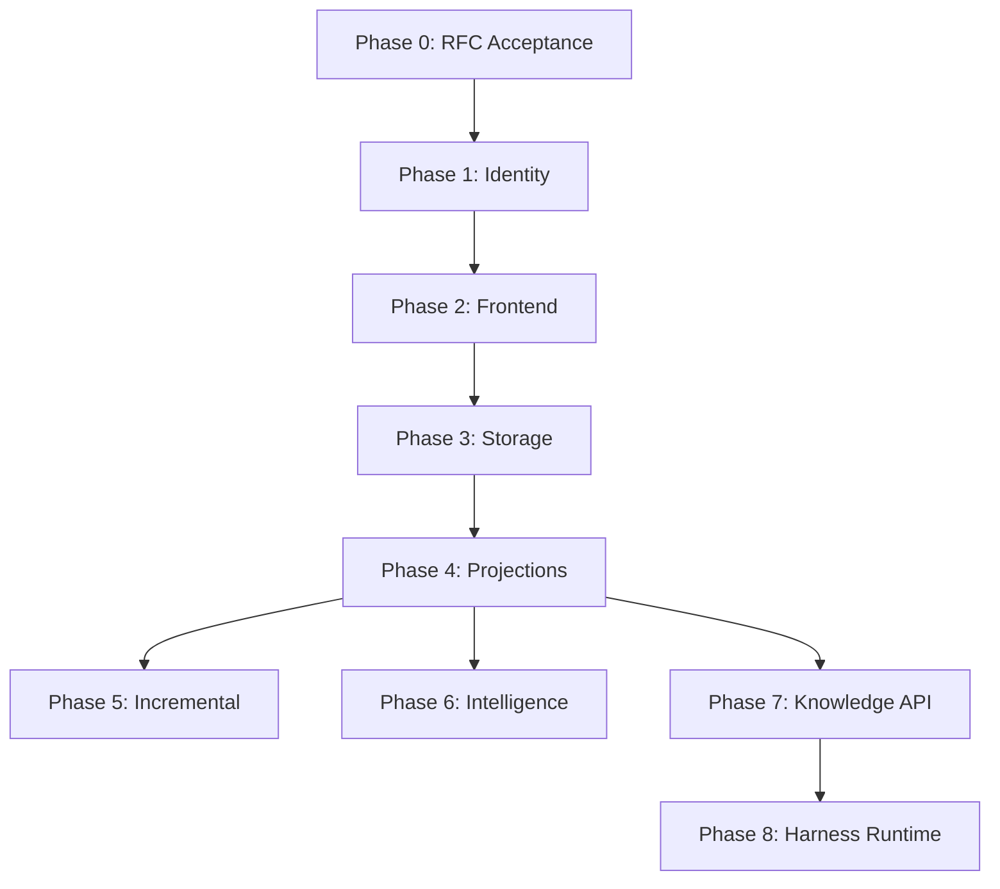

# StackMind — Implementation Plan v2 (Compiler-Backed Engineering Runtime)

### Metadata
- Version: 2.0
- Supersedes: PLAN-v1.md (runtime flaw analysis), PLANv1.md
- Authoritative source: docs/STACKMIND_ARCHITECTURE.md (Architecture Handbook)
- Date: 2026-07-17
- Status: COMPLETED — all 8 phases delivered, v2.0.0 shipped
- Author: Claude (Senior Architect), Session 1

### Executive Summary
StackMind v1.2.0 ships Runtime Governance (Pillar 1). This plan charts the path to compiler-backed engineering runtime — implementing Pillars 2 (Knowledge Compiler) and 3 (Harness Runtime). Central insight: every AI agent session rebuilds its understanding from scratch. The Knowledge Compiler transforms project state into persistent, deterministic, queryable knowledge.

### Current State vs Target
**What Exists (Pillar 1 — Shipped v1.2.0):**

| Component | Status | Location |
| :--- | :--- | :--- |
| CLI entry point | Shipped | `cli/main.py` (7 commands) |
| 4-layer validation | Shipped | `cli/validate.py` |
| Write lock PLAT-03 | Shipped | `cli/lock.py` |
| Promote with validation gate CLAUDE-01 | Shipped | `cli/promote.py` |
| Shutdown with inbox drain GEMMA-02 | Shipped | `cli/shutdown.py` |
| Migration engine | Shipped | `cli/migrate.py` |
| Normalization decisions PLAT-04 | Shipped | `cli/decisions.py` |
| Canonical drift detection PLAT-01 | Shipped | `cli/validate.py` Layer 4 |
| `.sync-ref` anchoring PLAT-05 | Shipped | `cli/validate.py` |
| CODEX-01 fresh TREE reads | Shipped | `cli/shutdown.py` |
| Schemas | Shipped | 7 runtime schemas |
| Tests | Shipped | >90% coverage on `cli/` |

**What Must Be Built (Pillars 2 & 3):**

| Component | Status | Planned Location |
| :--- | :--- | :--- |
| Identity Foundation | Planned | `cli/compiler/identity.py`, `cli/compiler/registry.py` |
| Compiler Frontend (LibCST) | Planned | `cli/compiler/frontend.py`, `cli/compiler/resolver.py` |
| Storage Layer & IR | Planned | `cli/compiler/storage.py`, `.sync/knowledge/nodes/` |
| Projection Engine | Planned | `cli/compiler/projector.py`, `.sync/knowledge/projections/` |
| Incremental Compiler | Planned | `cli/compiler/incremental.py`, `cli/compiler/watcher.py` |
| Background Intelligence | Planned | `cli/compiler/enrichment.py`, `cli/compiler/llm.py` |
| Knowledge API | Planned | `cli/compiler/api.py`, `cli/commands/graph.py` |
| Harness Runtime | Planned | `cli/harness/runner.py`, `cli/harness/tools.py` |

### Phase 0 — Architecture Freeze
- **Objective**: Close planning phase, record RFC acceptance
- **Deliverables**: RFC-001/002/003 acceptance, docs committed
- **Exit gate**: CEO sign-off on three core RFCs
- **Reference**: docs/rfcs/RFC-001 through RFC-006

### Phase 1 — Identity Foundation
- **Objective**: Permanent deterministic symbol identity with canonical sharded registry
- **Depends on**: Phase 0 (RFC-001 accepted)
- **Assigned to**: Codex
- **Workstreams**: Registry store, birth-hash minting, lifecycle, schema, Layer-5 stub, migration hook
- **Files created**: `cli/compiler/identity.py`, `cli/compiler/registry.py`, `cli/schemas/knowledge/registry.schema.json`
- **Acceptance gate**:
  1. Registry is created idempotently.
  2. Minting the same symbol twice yields identical hash.
  3. Identity hashes conform to format TYPE-first16(SHA256(birth_key)).
  4. Registry persists across CLI invocations.
  5. Schema validates successfully.

### Phase 2 — Compiler Frontend (Deterministic)
- **Objective**: Deterministic Source → IR. No LLMs. Byte-identical output.
- **Depends on**: Phase 1, RFC-003
- **Workstreams**: LibCST parser, symbol table, Jedi resolver, resolution tiers, IR definition, two-pass resolution
- **Files created**: `cli/compiler/frontend.py`, `cli/compiler/resolver.py`, `cli/compiler/ir.py`
- **Acceptance gate (DETERMINISM)**:
  1. No LLMs invoked during AST parsing.
  2. Parsing identical source files yields byte-identical IR.
  3. Symbol table correctly identifies functions, classes, and variables.
  4. Two-pass resolution resolves internal dependencies cleanly.
  5. Jedi correctly resolves external standard library boundaries.
  6. IR matches defined specification.

### Phase 3 — Storage Layer
- **Objective**: Persist IR as sharded, schema-validated, deterministic JSON
- **Depends on**: Phase 2, RFC-002
- **Workstreams**: Directory layout, node files, canonical serialization, revision stamping, atomic writes, schemas, Layer-5 expansion
- **Files created**: `cli/compiler/storage.py`, `cli/schemas/knowledge/node.schema.json`
- **Acceptance gate**:
  1. IR JSON is written atomically to `.sync/knowledge/nodes/`.
  2. JSON keys are strictly sorted.
  3. Schema validates stored nodes.
  4. Re-running the compiler on unchanged source produces NO diff in nodes.
  5. Layer 5 validation includes the storage directory.

### Phase 4 — Projection Engine
- **Objective**: Generate derived projections from IR. Prove rebuildability.
- **Depends on**: Phase 3
- **Workstreams**: Reverse Index, Search Index, Metrics, CLI graph command group, projector contract
- **Files created**: `cli/compiler/projector.py`, `cli/commands/graph.py`, `.sync/knowledge/projections/`
- **Acceptance gate (REBUILDABILITY)**:
  1. Projections can be deleted and entirely rebuilt from Nodes.
  2. Reverse index maps callees to callers correctly.
  3. Search index enables fuzzy matching.
  4. CLI graph stats outputs accurate metrics.
  5. Projections pass schema validation.

### Phase 5 — Incremental Compiler + Rename Detection
- **Objective**: Rebuild only affected symbols. Rename/move detection (C4).
- **Depends on**: Phase 4
- **Workstreams**: Content-hash dirty detection, affected-set computation, file watcher, rename/move detection, alias recording, batch scheduler, CLI graph update
- **Files created**: `cli/compiler/incremental.py`, `cli/compiler/watcher.py`
- **Acceptance gate**:
  1. Changing a function only rebuilds that function's node and callers.
  2. Unchanged files are skipped (zero parse time).
  3. Renaming a function preserves its original NodeID (via alias).
  4. Moving a function between files updates its lineage without losing identity.
  5. graph update handles partial updates efficiently.
  6. Determinism is preserved after an incremental update.

### Phase 6 — Background Intelligence
- **Objective**: Enrich nodes with LLM summaries and embeddings without touching deterministic path.
- **Depends on**: Phase 4, RFC-005
- **Parallelizable with**: Phase 5
- **Workstreams**: Enrichment queue, LLM summaries, embeddings, privacy policy, cost caps, failure discipline, CI guard
- **Files created**: `cli/compiler/enrichment.py`, `cli/compiler/llm.py`, `.sync/knowledge/enrichment/`
- **Acceptance gate**:
  1. Enrichment does not alter files in `.sync/knowledge/nodes/`.
  2. Summaries are persisted in separate enrichment projections.
  3. Embeddings are generated successfully.
  4. Cost tracking accurately reflects usage.
  5. Failures in enrichment do not block the main compiler pipeline.
  6. Privacy boundaries strictly respected.

### Phase 7 — Knowledge API + Agent Integration
- **Objective**: Agents consume knowledge through read-only API instead of re-reading files.
- **Depends on**: Phase 4, RFC-004
- **Workstreams**: Four query primitives, assemble_context, response envelope, CLI graph query, staleness handling, agent protocol update
- **Files created**: `cli/compiler/api.py`, `cli/commands/graph.py`
- **Acceptance gate**:
  1. Context assembly fits within specified token budgets.
  2. Queries resolve aliases correctly.
  3. Stale data is flagged explicitly, never silently served as fresh.
  4. Callers and impact queries traverse reverse indices correctly.
  5. The API provides a stable contract for the harness.

### Phase 8 — Harness Runtime
- **Objective**: Governed agent execution loop — the capstone.
- **Depends on**: Phase 7, RFC-006
- **Gate condition**: Knowledge API must prove value before harness is authorized
- **Workstreams**: Agent Runner, retrieval tools, verification gate, observability
- **Files created**: `cli/harness/runner.py`, `cli/harness/tools.py`
- **Acceptance gate**:
  1. Harness loops successfully without infinite loops (>3 identical reads).
  2. Verification gate catches invalid schemas.
  3. Writes only persist if validation passes.
  4. Output includes token, latency, and cost telemetry.
  5. Modifies codebase correctly based on assigned WO.

### Dependency Graph

### Cross-Cutting Requirements
- **Validation**: All changes must pass Layer-1 to Layer-5 validation.
- **Locking**: Writer locks enforced. PLAT-03 applies to all writes.
- **Determinism CI**: Automated checks to ensure deterministic builds.
- **Testing Ladder**: Unit, integration, and E2E tests for all components.
- **Provenance**: Traceability of all nodes back to source revisions.

### Design Decisions (from RFCs)
- **RFC-001**: Birth-hash identity (NodeID = TYPE-first16(SHA256(birth_key)))
- **RFC-002**: Three-tier storage (T0 canonical, T1 committed derived, T2 cache)
- **RFC-003**: Five-stage pipeline with deterministic boundary after Stage 3
- **RFC-004**: Four query primitives + context assembly
- **RFC-005**: Async enrichment with privacy policy
- **RFC-006**: Governed execution with verification gate

### Delivery Status
All phases complete. v2.0.0 shipped. 304 tests passing, 83% coverage.

### References
- docs/rfcs/RFC-001 through RFC-006 for detailed technical specifications
- docs/SMPOC/ for original research and POC designs
- docs/STACKMIND_ARCHITECTURE.md for the Architecture Handbook
