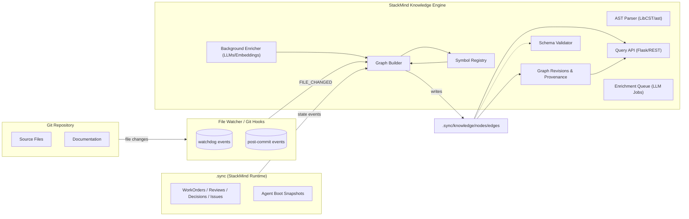
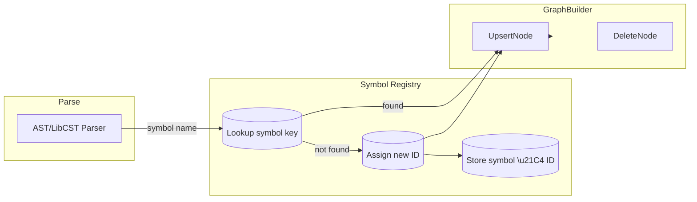

# StackMind Knowledge Compiler & Engine (POC v3)

**Executive Summary:** The StackMind Knowledge Compiler (SKC) with its Knowledge Engine (SKE) is a new runtime subsystem that continuously ingests a project’s code and StackMind state (work orders, reviews, decisions, issues, etc.) into a unified **Project Knowledge Graph**.  The graph is stored in sharded JSON under `.sync/knowledge/` (nodes/edges subfolders) and exposes a query API.  Agents (Planner, Coder, Reviewer, etc.) use `stackmind graph query` instead of re-parsing source files.  Deterministic structure (AST-extracted entities and relationships) is strictly separated from AI inferences (LLM summaries, inferred links) with confidence tags.  A background pipeline enriches nodes with summaries and embeddings (via the OpenAI Embeddings API) but never blocks the hot path.  StackMind’s existing authority model and write-lock ensure the graph can only be updated via validated runtime events (file changes, work-order updates, etc.).  This design is a fully incremental, versioned knowledge engine: reliable and diff-friendly (no DB, just JSON) for an initial POC. 

This document outlines the production-oriented POC: goals and scope, architecture (with Mermaid diagrams), data model, stable ID and symbol-registry design, AST extraction and call-resolution strategies, storage layout, incremental update and eventing, enrichment pipeline, versioning and validation, CLI/API, milestones and roadmap, risks and tests, and proposed tech stack. 

## Goals & Non-Goals

- **Goals:** Build a *persistent project memory* for StackMind: a queryable graph combining code structure and runtime artifacts.  All code entities (modules, classes, functions, etc.) and work artifacts (WOs, Reviews, Decisions, Issues) become graph nodes; edges capture relationships (calls, imports, assignments, reviews, fixes, etc.).  The graph is updated **incrementally** on file or state changes, and can answer queries like “what calls this function?” or “show all work orders touching module X.”  Agents use this graph to reduce redundant parsing and to reason across files.  Deterministic parsing (AST) yields ground-truth edges with confidence=1.0; LLMs supply optional context (summaries, inferred relations) tagged with confidence.  **Production focus:** sharded JSON in Git (no external DB), robust versioning/provenance, schema-validated outputs, and asynchronous ML work (for low latency).

- **Non-Goals:** Not building a full graph database or heavy vector store.  Initial POC will **not** integrate a database like Neo4j or a managed vector DB.  Focus on correctness and usability, not on performance at very large scale.  The Knowledge Graph is *derived state*, not a second source of truth: StackMind’s `.sync/` remains authoritative.  Agents do **not** write graph files directly; all updates come from StackMind events (to preserve authority and validation).  This POC omits multi-language support (start with Python) and deep ML inference (only simple summaries, embeddings).  It does not include advanced query language or UI—just a basic CLI and JSON API.

## High-Level Architecture



- **FileWatcher & Events:** Uses Python’s [watchdog](https://pypi.org/project/watchdog) to listen for file system changes (create/modify/delete) and Git hook triggers for new commits.  These generate FILE_CHANGED events (with file paths) and GIT_COMMIT events.
- **Runtime Events:** WorkOrder/Review/Decision lifecycle actions (create/update/close) emit StackMind events. The GraphBuilder consumes all events but only applies updates after StackMind’s Layer-3 validation passes.
- **AST Parser:** On each event (file save or relevant change), the Parser (LibCST or `ast`) extracts code entities. LibCST is preferred for precise source mapping; Python’s built-in `ast.parse` is an alternative.
- **Symbol Registry:** A persistent map of fully-qualified symbol names to NodeIDs. When parsing, new symbols are registered or looked up, ensuring **stable IDs** (see below). This avoids changing node IDs on each build.
- **Graph Builder:** Merges Parser output into sharded JSON stores: creating/updating node files under `.sync/knowledge/nodes/<Type>/` and edge files under `.sync/knowledge/edges/<RELATION>.json`.
- **Enrichment Queue / Enricher:** New or changed nodes/edges are queued for AI enrichment. A background worker invokes LLMs for summaries (e.g. via function-calling or `text-davinci-004`) and OpenAI for embeddings. Results update the JSON asynchronously.
- **Query API:** A simple local API (e.g. Flask or FastAPI) to answer `stackmind graph query` calls by traversing JSON (or pre-built indices). Supports targeted queries (e.g. find node by name, list callers of a function, work orders for a file, etc.).
- **Schema Validator:** Integrates with `stackmind validate` to ensure every `.sync/knowledge` JSON file conforms to schema (node/edge shape, required fields). Errors appear in validation reports.

## Data Model

We define a unified graph schema covering both code and runtime artifacts.  Data is stored in JSON files within `.sync/knowledge/` (see **Storage Layout** below). 

### Node Types

Typical node entity types (examples):

- **Code Entities:** `Module`, `Class`, `Function`, `Method`, `Variable`  
- **Work Items:** `WorkOrder`, `Review`, `Decision`, `Issue`  
- **Agents/Tools:** `Agent`, `Tool`, `Prompt`  
- **Artifacts:** `File` (or `Directory`), `ConfigFile`, `DatabaseTable`, `API`, `SQL`  
- **Metadata:** `Commit`, `Version`, etc. (optional, can model if needed)  

These align with common code knowledge graphs.  For brevity, the POC will focus on: *Module*, *Class*, *Function*, *WorkOrder*, *Review*, *Decision*, *Issue*, and *File*.  The table below expands core fields:

| Node Type   | Key Fields                                   | Example Instance                      |
| ----------- | -------------------------------------------- | ------------------------------------- |
| **Module**  | `name`, `path` (file path, e.g. `src/auth.py`) <br> `deterministic.hash` (file hash) <br> `ai.summary`         | `{"id":"MOD-1A2B3C","type":"Module","name":"auth","path":"src/auth.py", "deterministic":{...}}` |
| **Class**   | `name`, `parent_module`, `bases`            | `{"id":"CLASS-4D5E6F","type":"Class","name":"User","path":"src/models.py", ...}` |
| **Function/Method** | `name`, `signature`, `parent` (module or class) <br> `summary` (AI)         | `{"id":"FUNC-ABC123","type":"Function","name":"route_query","path":"planner.py","signature":"(question)","summary":"Routes questions to agents.", ...}` |
| **WorkOrder** | `id`, `title`, `status`, `priority`, `assignments`, `deliverable_path` | `{"id":"WO-431","type":"WorkOrder","title":"Add auth","status":"ACTIVE","assigned_agents":["codex"],"deliverable":"src/auth/","priority":"P1"}` |
| **Review**  | `id`, `title`, `outcome`, `workorder_id`      | `{"id":"REV-37","type":"Review","title":"Auth Review","outcome":"CHANGES_NEEDED","work_order":"WO-431"}` |
| **Decision**| `id`, `summary`, `author`, `affects`         | `{"id":"DEC-12","type":"Decision","summary":"Normalize enum values","author":"Claude","affects":[{"node_id":"WO-001"}]}` |
| **Issue**   | `id`, `description`, `severity`, `related_nodes` | `{"id":"ISSUE-5","type":"Issue","description":"Potential memory leak","confidence":0.92,"related":[{"type":"Function","id":"FUNC-3921"}]}` |

*(Fields `deterministic` and `ai` are nested blocks in each node for ground-truth vs LLM info, see Schema below.)*  

### Edge Types

Edges capture relationships between nodes.  Key edge types:

- **CALLS** – function-to-function or method call; determined by static analysis (AST/Jedi). 
- **IMPORTS** – module-to-module import relations (file includes).
- **CONTAINS** – module/class contains function, class, or variable.
- **DEPENDS_ON** – WorkOrder/Issue depends on something (e.g. WO depends on another WO).
- **ASSIGNED_TO** – WorkOrder assigned to an Agent.
- **REVIEWS** – Review associated with a WorkOrder or Code Node.
- **FIXES** – Issue or Review fixes a WorkOrder or bug report.
- **GENERATED_BY** – e.g. code generated from a prompt/WorkOrder.
- **DOCUMENTS** – Node is documented by a Review or by code comments.
- **USES**/**OWNS** – (optional: e.g. WorkOrder uses tool, module owns config).
- **TESTS** – Test function covers a Function or module.

These are inspired by common schema (FalkorDB code graph, pharaoh blog).  For example:
```
{"source":"FUNC-ABC123","target":"FUNC-DEF456","type":"CALLS","relation":"calls","deterministic":true}
```
represents that function `ABC123` calls `DEF456`.  Every edge also has deterministic/AI split with confidence 1.0 for extracted edges. 

#### Example JSON

**Function Node:**
```json
{
  "id": "FUNC-92AB34",
  "type": "Function",
  "name": "route_query",
  "path": "planner.py",
  "signature": "(question)",
  "deterministic": {
    "hash": "af8392e1",  
    "location": { "line": 10, "col": 0 }
  },
  "ai": {
    "summary": "Routes questions to the appropriate agent based on topic.",
    "confidence": 0.95
  }
}
```
**WorkOrder Node:**
```json
{
  "id": "WO-431",
  "type": "WorkOrder",
  "title": "Add user authentication",
  "status": "ACTIVE",
  "priority": "P1",
  "assigned_agents": ["codex"],
  "deliverable": "src/auth/",
  "deterministic": { "created": "2026-07-11T14:23:00Z" }
}
```
**Edge (CALLS):**
```json
{
  "source": "FUNC-92AB34",
  "target": "FUNC-A1B2C3",
  "type": "CALLS",
  "relation": "calls",
  "deterministic": { "confidence": 1.0 }
}
```

## Deterministic NodeID Specification

Every graph node must have a **stable, deterministic NodeID** so that incremental rebuilds and merges do not break edges.  We derive the NodeID from immutable symbol properties. For Python code entities, one approach is:

```
ID = TYPE + "_" + SHA256(module_path + ":" + qualified_name)
```

- `module_path` = repository-relative file path (e.g. `src/auth.py`).
- `qualified_name` = full dotted name (e.g. `AuthService.login` for method `login` in class `AuthService`).
- `TYPE` = short type prefix (FUNC, CLASS, MOD, WO, etc). 

*Example:* Module `src/auth.py` → `MOD_1a2b3c...`; Function `AuthService.login` in `src/auth.py` → compute SHA256 of `"src/auth.py:AuthService.login"`, take first 8 hex chars, prefix `FUNC-` → e.g. `FUNC-92ab34ef`. 

This ensures:
- **Stable IDs:** changing unrelated code or context does not affect existing IDs.
- **Branch-independent:** as long as paths and names are same, IDs match across branches/clients.
- **Incremental-safe:** when renaming a symbol, the ID changes (and you can detect moved symbols via registry diff, see below).

In JSON, we store both the `id` and the underlying deterministic hash.  Any system component (e.g. Symbol Registry) generates IDs via this formula.  For non-code nodes (WorkOrder, Review, etc.), we use their natural IDs (WO-###).  

## Symbol Registry Design

The **Symbol Registry** is the central mapping of code symbols to NodeIDs.  On each parse, we compute the fully-qualified name of each class/function/variable and look it up in the registry.  If not present, assign a new ID (using the above formula) and record it.  The registry is itself JSON-backed (e.g. a key-value file or a compact database in `.sync/cache/`) linking `module_path + symbol_name` → `node_id`.  

**Roles:**
- **ID Generation:** Ensures stable ID per symbol by consistent hashing.
- **Rename Detection:** If a symbol’s qualified name changes, registry lookup fails; SKC can detect a renamed node by comparing content or use a “moved” edge (optional).
- **Incremental Updates:** Registry diff between builds indicates which IDs to add or delete.

Mermaid flow for symbol registry (simplified):



As code is parsed, each symbol name is checked.  On change, GraphBuilder uses the ID to update the corresponding node JSON (or create/delete).  The Registry may also map file paths to module IDs.

## AST Extraction Strategy (Python)

For Python code, we need to extract modules, classes, functions, methods, and simple variable definitions. We propose using **LibCST** (or Python’s `ast` module) in a visitor pattern. LibCST is robust and preserves formatting, but for a POC, the built-in `ast.parse` is acceptable for structure. 

Key steps:
1. **Parse Source:** Use `cst.parse_module(code_str)` or `ast.parse(code_str)` to get syntax tree.
2. **Visit AST:** Traverse AST nodes:
   - On `ClassDef`, `FunctionDef`, `AsyncFunctionDef`: record name, parent, parameters.
   - On `Import`/`ImportFrom`: record module import edges.
   - On `Assign` at module level or class-level: optional `CONTAINS` edges for variables.
3. **Qualified Names:** Maintain a stack of current class/module names to derive fully-qualified names.
4. **Hash Code:** Compute SHA256 of file content (using Python `hashlib`) to detect changes.
5. **Emit Entities:** For each class/function, construct a node entry with deterministic fields (name, signature, location, etc).  

For example, using LibCST:

```python
import libcst as cst
from libcst.metadata import QualifiedNameProvider, QualifiedName, MetadataWrapper

class SymbolCollector(cst.CSTVisitor):
    METADATA_DEPENDENCIES = (QualifiedNameProvider,)
    def __init__(self):
        self.symbols = []
    def visit_FunctionDef(self, node):
        qnames = self.get_metadata(QualifiedNameProvider, node)
        fq_name = ".".join([str(n.name) for n in qnames if isinstance(n, QualifiedName)])
        self.symbols.append(fq_name)

module = cst.parse_module(source_code)
wrapper = MetadataWrapper(module)
collector = SymbolCollector()
wrapper.visit(collector)
print(collector.symbols)
```

This yields qualified names for functions/classes.  (LibCST’s `QualifiedNameProvider` helps resolve imported names to actual definitions.)  

**AST Tools:** 
- [LibCST](https://libcst.readthedocs.io/) provides a safe, full-fidelity parser and visitor pattern.
- Python’s built-in [ast](https://docs.python.org/3/library/ast.html) is simpler and faster, but requires manual resolution of nested names.
- **Jedi** can complement parsing: after building initial graph, one can use Jedi to resolve ambiguous references (calls, dynamic imports, aliasing) by asking `jedi.Script(...).infer()`.  

## CALLS-Edge Resolution

Identifying CALLS edges (which function calls which) is the hardest part of Python static analysis. We will use a best-effort approach:

1. **Static Name Resolution:** For simple calls (no `eval`, no dynamic dispatch):
   - Use AST/LibCST to find all `Call` nodes.  
   - Determine the function name (e.g. if `ast.Call.func` is a Name or Attribute).  
   - Resolve the name to a symbol in the graph:
     - If it’s a simple name (e.g. `foo()`), look up in current or imported scope.
     - If it’s an attribute (e.g. `obj.method()`), use Jedi or tracking of `self`/class instances.
   - We can simplify: assume any call to a known function/class maps to that symbol (requires symbol table or Jedi).

2. **Jedi Resolution:** For ambiguous or cross-file calls, use [Jedi](https://jedi.readthedocs.io/)‘s `script.goto()` or `infer()` to find the definition of the function name and thus the target node ID.  For example:
   ```python
   import jedi
   script = jedi.Script(source, path='planner.py')
   definitions = script.goto(10, 15)  # line=10, column=15 where call occurs
   # definitions[0].module_path and .name give us target symbol
   ```
   This maps names to file paths and symbol names, which then map to NodeIDs via the Symbol Registry.  

3. **Unresolved Calls:** Many calls may remain unresolved (dynamic dispatch, missing imports, or external libraries). Instead of dropping them, we record a **placeholder edge** with `target=null` and a flag:
   ```json
   { "source":"FUNC-92AB34", "target":null, "type":"CALLS", 
     "relation":"calls", "deterministic":{"confidence":0.4,"note":"unresolved name 'auth.login'" } }
   ```
   This lets the system optionally retry resolution (or have an agent fill it in).  Graphify similarly tags uncertain edges as `AMBIGUOUS` or `INFERRED`.

4. **Edge Annotation:** All CALLS edges from static parse are marked deterministic with confidence 1.0. Any guess (via Jedi) could be lower confidence and flagged as `ai.inferred`.  

**Best-Effort Rules:** 
- Prefer intra-repository functions; if call to external library (e.g. `requests.get`), skip or mark differently.
- Follow import aliases: track `import json as js`; calls to `js.dump()` map to `json.dump`.
- Handle `from x import y` by mapping symbol `y` to module path.
- We do *not* execute code; just pattern-match the AST.

In short, the CALLS-edge strategy is: use LibCST/AST + Jedi to resolve calls, store edges for resolved calls, and flag unresolved ones.

## Storage Layout

We store the graph under `.sync/knowledge/` in Git (or version control). The layout is *sharded* by type to avoid one huge file and ease merging:

```
.sync/
└── knowledge/
    ├── nodes/
    │   ├── Module/
    │   │   ├── MOD-1a2b3c.json
    │   │   └── ...
    │   ├── Class/
    │   │   ├── CLASS-4d5e6f.json
    │   │   └── ...
    │   ├── Function/
    │   │   ├── FUNC-92ab34.json
    │   │   └── ...
    │   ├── WorkOrder/
    │   │   └── WO-431.json
    │   └── Review/, Decision/, Issue/, etc.
    ├── edges/
    │   ├── CALLS.json         # list of CALLS edges
    │   ├── IMPORTS.json
    │   ├── CONTAINS.json
    │   ├── ASSIGNED_TO.json
    │   ├── REVIEWS.json
    │   └── ... (one file per edge type)
    └── graph-revisions/
        └── REVISION-0001.json  # metadata about graph builds
```

- **Nodes/**: each node is a file named by its ID (e.g. `FUNC-92ab34.json`).  This makes diffs and merges straightforward.
- **Edges/**: each edge file is a JSON array of edge objects for a given `type`.  E.g. `CALLS.json` contains all CALLS edges (each with source, target, type, etc).
- **Graph-Revisions/**: stores metadata about each build/refresh of the graph (timestamp, git SHA, SKC version, etc), enabling reproducibility.
- **Cache/** (optional): we may keep a cache of computed embeddings or parsing metadata outside of Git (e.g. `.sync/cache/embeddings/`).

This layout avoids monolithic files. (A previous draft’s single `graph.json` was abandoned due to merge issues.)  The write-lock serializes updates so one agent can safely modify these.

## Incremental Update Algorithm

On each triggering event (file save, git commit, or runtime event):

1. **File Hashing:** Compute SHA256 of changed file and compare to stored hash in `.sync/knowledge/cache/hashes.json`.  If unchanged, skip. Else mark file dirty.
2. **AST Diff:** For each dirty file:
   - Parse the file to get new symbols and edges.
   - Compare with old version (if any): use Symbol Registry diff or compute hash of AST.
   - **Node Updates:** For new symbols, create new node JSON. For removed symbols, delete node JSON. For changed symbols, update their JSON (e.g. code changes might update `deterministic.location` or `deterministic.hash`).
   - **Edge Updates:** Recompute edges (CALLS, IMPORTS, etc) for this file. Overwrite that file’s contributed edges in the edge arrays.
3. **WorkItem Events:** For a WorkOrder/Review event, update the corresponding node under `nodes/WorkOrder/WO-xxx.json`. GraphBuilder listens to these events (e.g. WorkOrder closed means mark status and close_target).
4. **Acquire Write Lock:** Before writing any JSON files, acquire the `.sync/runtime/LOCK` (StackMind’s write lock) to avoid races. Release after done.
5. **Write Changes:** Update the affected JSON files under `.sync/knowledge/` and update `hashes.json`. Commit the updates to the `.sync` repository (if using an underlying Git repo, or just leave them for later bundling).
6. **Queue Enrichment:** Add changed/new node IDs to the background queue for AI summary/embeddings.

This incremental strategy ensures only modified parts are rewritten (others stay intact), keeping Git diffs small.  The write-lock prevents concurrent agents from clobbering each other (agents normally serialize writing critical sections under lock).

## Event-Driven Ingestion

SKC is **event-driven**. Sources of events include:

- **Git Events:** A commit hook (or periodic poll) emits events for new commits. We capture the changed files.
- **FileSystem Events:** Using *watchdog*, we get immediate notifications on file create/modify/delete (covering editors and scripts).
- **StackMind Runtime Events:** Whenever a WorkOrder, Review, or Decision is created/updated/completed, we emit a SKC event (only after passing the normal validation!).  For example, on `stackmind shutdown` of an agent, a summary Review is generated and an event triggers adding a Review node.
- **Ordering & Idempotency:** Events include a unique ID (e.g. Git SHA or WorkOrder ID) so duplicates are ignored. We process events in sequence and each change is idempotent (re-applying AST parse yields same JSON).
- **Graph-Revisions:** After a batch of events, we record a new revision file (`REVISION-000n.json`) containing metadata: 
  ```json
  {
    "id": 182,
    "timestamp": "2026-07-12T10:23:45Z",
    "git_commit": "abc123...",
    "tree_commit": "def456...", 
    "stackmind_version": "1.2.0",
    "parser_version": "Python ast 3.14",
    "embedding_model": "text-embedding-3-small",
    "node_count": 1782,
    "edge_count": 5321
  }
  ```
  This ensures provenance: any query result can be traced to the exact code/state version.

## Background Enrichment Pipeline

LLM and embedding work runs **asynchronously**. Key points:

- **LLM Summaries:** For each new code node (e.g. function/class) or WorkOrder, we call a model (e.g. OpenAI GPT-4 via function calling or Claude via action format) to generate a natural-language summary or description. We include confidence or mark uncertain items. Example: for `route_query`, we get "This function dispatches questions to appropriate agents."
- **Embeddings:** We compute a text embedding for each node (e.g. using `text-embedding-3-small`) based on its name/signature/summary. These vectors are stored for semantic search (GraphRAG integration later). 
- **Caching:** Node content hash is stored, so if the node text didn’t change, reuse its previous embedding/summary.  Avoid paying for duplicate calls.
- **SLA/Constraints:** The background worker should limit throughput (rate-limit API calls, handle retries).  We don’t block queries or agent tasks waiting for it.  Ideally all new nodes are enriched within 5-10 minutes of creation (configurable).
- **Failure Handling:** If an API call fails, log and retry. Enrichment is “nice-to-have”; missing summaries do not prevent graph usage.

This two-pass approach (deterministic first, semantic second) follows Graphify’s model. All AI contributions are tagged with source `inferred` and a confidence score, so queries can filter them if needed.

## Embedding Storage Policy

Embeddings and other large binary data should **not** clutter Git history. We treat embeddings as a cache:

- Store embeddings in `.sync/cache/embeddings/` (e.g. one file per node or a SQLite backend), **gitignored**.
- On graph rebuild, reuse embeddings for nodes with identical content (via hash match).
- Embeddings are *not* considered canonical state; if lost, we can recompute them.
- In practice: add `knowledge/embeddings/` to `.gitignore`, or package all embeddings in a single file (e.g. `embeddings.db`) kept out of `.sync`.

This ensures the Git-tracked parts of `.sync` remain text-only and diffable.

## Graph Versioning & Provenance

Each graph build writes a revision record as shown above.  Additionally:

- We embed the Git HEAD SHA in each node/edge JSON (or at least in the revision) so we know which code commit they came from.
- The file `.sync/knowledge/TREE.yaml` (if used) could track totals by type; but our revision logs suffice.
- Agents and CLI commands can report “Graph version N (built on commit abc123)”.

This lineage ensures reproducibility: if a query result is surprising, you can check the build metadata to see what code state produced it.

## Validation & Schema Rules

We define JSON Schemas for our node and edge formats (in `stackmind/schemas/knowledge/`). Example rules:

- **Node Schema:** required `id`,`type`; allowed fields differ by type (e.g. WorkOrder must have `status`,`priority`). All nodes must have `deterministic.hash` or timestamp, `ai` fields (even if empty object).
- **Edge Schema:** required `source`,`target`,`type`; `target` can be null but then require a `note`. 
- **Graph Revision:** must have timestamp, git_commit, version, etc.

We add these to `stackmind validate` so that `stackmind validate` will flag any malformed knowledge JSON.  Validation is layered (Schema → Structure → Protocol → Boot → Knowledge). Knowledge validation is a new **Layer 5**. For example, it checks:
- No unknown keys in node files.
- All `type` fields are one of the allowed enums (and values normalized).
- `target` IDs in edges actually exist (unless marked unresolved).
- No duplicated edges.

This prevents silent drift: if an agent writes a bad node (though normally they don't write directly), `validate` will catch it.

## CLI & API Surface

We introduce new `stackmind` commands and a minimal API:

- `stackmind graph build` – Build (or rebuild) the entire graph from scratch. (Writes `.sync/knowledge/` from empty or scratch.)
- `stackmind graph update` – Incrementally update graph after new commits/events (equivalent to `watch` but one-shot).
- `stackmind graph watch` – Long-running daemon that watches for changes and auto-updates the graph (like a file watcher).
- `stackmind graph query <query>` – Query the graph. For example:
  ```
  $ stackmind graph query --type Function --name authenticate
  Found 2 functions: FUNC-123 (Authenticate), FUNC-456 (login.authenticate).
  ```
  Or free-text search: 
  ```
  $ stackmind graph query "related to authentication"
  ```
- `stackmind graph stats` – Show node/edge counts, last build info, active lock, etc.
- `stackmind graph versions` – List recent graph revisions with metadata.

These use underlying Python libraries (e.g. click/argparse).  The `graph query` command likely calls into an HTTP API (e.g. `localhost:5000/query`) or a direct Python module function.

## POC Milestones & 6-Week Roadmap

| Week | Milestone                                    | Deliverables                          |
|------|----------------------------------------------|---------------------------------------|
| **1**  | **Foundation:** AST parsing, JSON output         | - `stackmind graph build` command<br>- Basic parser (LibCST/ast) for modules/classes/functions<br>- Sharded JSON schema + writing under `.sync/knowledge/nodes`<br>- WorkOrder nodes sync from `.sync/runtime` (stub)<br>- Initial `CALLS`/`IMPORTS` edges from static parse |
| **2**  | **Query & Symbol Reg:** Searchable data model     | - Symbol Registry implementation (stable IDs)<br>- `graph query` CLI (simple filters: list functions, WOs, etc)<br>- CALLS-edge resolution with static rules + Jedi fallback<br>- Detection of unresolved calls and storing them<br>- Graph version metadata file |
| **3**  | **Incremental & Eventing:** File watcher         | - `stackmind graph watch` daemon with watchdog<br>- File hashing (`hashlib.sha256`) to detect changed files<br>- Handle FileCreated/Modified/Deleted events & diff update logic<br>- Integrate with StackMind write-lock<br>- Unit tests for parser & update pipeline |
| **4**  | **Background Enrichment:** LLM summaries & embeddings | - LLM summary generator (e.g. ChatGPT function call) for new nodes<br>- OpenAI embedding integration (using `openai` Python lib)<br>- Async queue & worker (multithreading/asyncio)<br>- Caching of enrichment results (on file hash)<br>- CLI `graph stats` (node counts, last enrichment run) |
| **5**  | **Schema & Validation:** Integrate with stackmind validate | - JSON Schema definitions for nodes/edges<br>- Extend `stackmind validate` to include knowledge checks<br>- Enforce rules: no duplicate WOs, WO status flow, etc.<br>- CLI `graph versions` (list builds)<br>- Basic documentation (AGENTS.md update) |
| **6**  | **UX & Polish:** CLI, stability, docs, tests       | - Complete CLI coverage, help messages<br>- Example `.sync-ref` anchoring (verify .sync commit matches main repo)<br>- Demo scenarios: graph.query after a code change, cross-check<br>- Finalize README updates, sample JSON outputs, risk matrix, test plan documentation |

Each milestone includes code, tests, and docs.  By the end of 6 weeks, we have a working POC integrated into StackMind’s build and release.

## Risk Matrix & Mitigations

| Risk / Challenge                         | Mitigation                            |
|------------------------------------------|---------------------------------------|
| **Stable IDs change on refactors** – If symbol names/paths change, IDs shift. | Use Symbol Registry to detect renames. Store symbol→ID mapping and compare old/new to re-link nodes. Consider adding `aliased_to` edges or metadata. |
| **Unresolved CALLS edges** – Many dynamic calls cannot be statically resolved. | Record unresolved calls rather than drop. Flag them for manual review or later AI inference.  Provide confidence score 0 for guess. |
| **Graph.json merge conflicts** – Single graph file was unmanageable. | Use sharded files from start (nodes per file, edges per type) to minimize diffs. |
| **Write lock contention** – Long-running watch daemon can block others. | Acquire lock only around actual write operations (batch file updates), then release immediately. Don’t hold lock during enrichment. |
| **LLM/Embedding cost & latency** – LLM calls may be slow or costly. | Keep them out of hot path. Use smaller models (e.g. `text-embedding-3-small`). Cache results aggressively by content hash. |
| **Schema drift** – Changing JSON format without validation. | Integrate all new files into `stackmind validate`. Define JSON Schemas in `schemas/` and run them on every validate (as a new validation layer). |
| **Large codebase scaling** – JSON files may grow large (e.g. 10k funcs). | Sharding mitigates this. If needed, limit initial POC to essential nodes. Future: consider a lightweight DB or indexed format. |
| **Security:** Don’t send raw code to LLM. | Only send summaries or documentation to LLMs, never raw source. (Graphify practice). Strict validation on input content. |
| **User Adoption:** Agents must use the graph. | Provide clear CLI and explain in docs. Initially, use Graph for _queries_ only, letting agents optionally incorporate results into context. |

## Testing Plan

- **Unit Tests:** For AST parsing functions (given a code snippet, verify extracted nodes/edges). Test symbol registry (ID stability). Test update logic (simulate changing a file, see correct node JSON diff). 
- **Integration Tests:** Use a sample Python project: run `graph build`, then modify files and rerun `graph update`, verify JSON changes as expected.  Test queries return correct info. 
- **Schema Tests:** Validate known-good and known-bad JSON against schemas to ensure errors are caught. 
- **Performance:** On a medium codebase (e.g. 100 files), measure build/update times. Ensure incremental update is much faster than full rebuild.
- **Regression:** After each milestone, add tests for new feature. e.g., after adding watch, test file events are handled.
- **Manual QA:** Smoke-test with real agent workflows: e.g. trigger an agent to search via the knowledge graph and verify it sees expected edges.

## Minimal Tech Stack & Libraries

- **Language:** Python 3.10+.
- **Parsing:** [LibCST](https://libcst.readthedocs.io/) or builtin `ast` (stdlib).
- **Name Resolution:** [Jedi](https://jedi.readthedocs.io/) for finding definitions (autocomplete engine).
- **JSON Schema:** [jsonschema](https://pypi.org/project/jsonschema/) for validation integration.
- **Embeddings/LLM:** [openai](https://pypi.org/project/openai/) Python library; configure to use `text-embedding-3-small`.
- **File Watching:** [watchdog](https://pypi.org/project/watchdog/) for FS events.
- **CLI:** [argparse](https://docs.python.org/3/library/argparse.html) or [click](https://pypi.org/project/click/) for `stackmind graph ...` commands.
- **Concurrency:** Standard threading or asyncio for background tasks.
- **Storage:** JSON files on disk (no external DB).  Optionally [networkx](https://networkx.org/) if needed for in-memory queries, but not required for POC.
- **Logging/Config:** Python `logging` and simple config (toml/json) for settings.

This stack emphasizes no new heavy infrastructure, reusing StackMind’s existing Git-backed runtime and Python ecosystem. All choices favor ease-of-development and debuggability.

