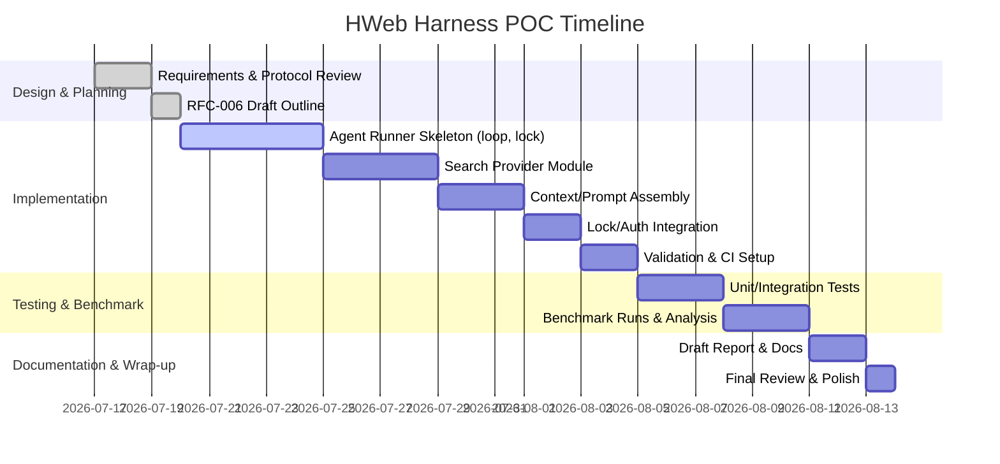

# Executive Summary

StackMind is a Python-based CLI platform for orchestrating multi-agent workflows, using a canonical `.sync/` workspace for all runtime state (messages, work orders, decisions).  It provides JSON schemas and multi-layer validation logic (init, validate, doctor, migrate, shutdown, promote, lock) to ensure consistency.  **Our POC proposes adding a new “Harness Runtime” agent – the *Agent Runner* – that periodically polls StackMind for tasks, optionally performs a web search via an external API, calls an LLM with enriched context, and writes structured results back to the `.sync/` store.**  This integration is entirely **additive** (no modifications to existing code), aligning with StackMind’s design (the CLI supports extensions).  

Key prerequisites include a configured StackMind project (`stackmind init` creates the `.sync/` repo and `AGENTS.md`), Python 3.10+ (StackMind requires ≥3.10), and API credentials for any chosen LLM and search provider.  Critically, the Runner must operate under StackMind’s governance protocol: it must register as an agent in `AGENTS.md`, use the `.sync/runtime/LOCK` write-lock for any canonical writes, and pass all writes through `stackmind validate`.  We sketch out **RFC-006** (“Harness Runtime”) defining the Runner’s responsibilities, lifecycle, and failure modes, and then detail the Agent Runner design, a Search-Provider abstraction (for Perplexity, SerpAPI, etc.), retrieval logic (when to search), context-building (internal+external), caching, retry policies, observability, benchmarking plan, cost modeling, tests, and an implementation timeline (see Gantt chart below).  

Overall, the plan is feasible: it leverages StackMind’s extension points and validation framework, aligns with the SKC design principles (LLM calls are external to the deterministic path), and isolates web-search as a tool.  We expect the Runner to improve agent knowledge (reducing hallucination) at the cost of higher latency and API fees (see Cost Analysis).  Before coding, the remaining gaps are purely *protocol integration* (lock management, authority, identity, shutdown semantics) which we will address in design.  With these clarified, the POC should reliably demonstrate performance impacts and cost trade-offs for StackMind with web search.

# Implementation Prerequisites

Before building the Harness integration, ensure the environment meets StackMind’s requirements and that necessary credentials/tools are in place:

- **StackMind CLI installed:** Install the `stackmind` package (requires Python ≥3.10).  Initialize a project so that `stackmind init` has generated an `.sync/` workspace with the standard layout.  
- **Python 3.10+ environment:** StackMind’s `pyproject.toml` requires Python ≥3.10. Use `venv` or Conda as needed.  
- **StackMind Project Setup:** A project directory with `AGENTS.md` (authoritative agent roles) and `.sync/` (runtime store) is needed.  For testing, you may use the provided sample or template runtime.  
- **Search API credentials:** If using an online search API (Perplexity, SerpAPI, etc.), obtain API keys and set environment variables (e.g. `PERPLEXITY_API_KEY`, `SERPAPI_API_KEY`) according to the provider’s docs.  
- **LLM credentials or endpoint:** Configure access to your chosen LLM (OpenAI, Anthropic, a local model via Ollama/LMStudio, etc.).  For example, set `OPENAI_API_KEY` or `LLM_API_BASE` as needed.  
- **Optional local tools:** If experimenting with local knowledge sources (e.g. a vector index or Wikipedia dump), install/prepare those separately.  

We assume no changes to existing StackMind code: all new logic (Agent Runner, search adapters, etc.) will live alongside as new modules or CLI subcommands.

# StackMind Runtime Artifacts & Validation Schemas

StackMind enforces a precise directory and schema layout for runtime state.  After `stackmind init`, the project has this structure:

```
my-project/
├── AGENTS.md              # Authoritative agent/role definitions
└── .sync/                 # Runtime instance (separate git repo)
    ├── RUNTIME_VERSION    # StackMind version tracking
    ├── PROTOCOL_DIGEST.md # Compiled protocol rules
    ├── SYSTEM_CONTEXT.md  # Env details
    ├── runtime/           # Runtime state (Claude-owned files)
    │   ├── TREE.yaml      # Team state index (work-orders summary)
    │   ├── LOCK           # Write lock file (when held; serializes canonical writes)
    │   ├── boot/          # Agent canonical boot snapshots (Claude writes)
    │   ├── drafts/        # Agent draft snapshots (workers write here)
    │   └── receipts/      # Shutdown receipts
    ├── work-orders/       # Task management
    │   ├── INDEX.yaml     # Canonical registry of all WOs
    │   ├── ACTIVE/        # Active work orders (to be worked on)
    │   ├── COMPLETED/     # Finished work orders
    │   └── BLOCKED/       # Blocked WOs
    ├── agents/            # Agent contracts (e.g. `claude.agent.md`, etc.)
    ├── inbox/             # Messages to agents (subdir per agent plus CEO)
    ├── outbox/            # Reports or output from agent sessions (one file per session)
    ├── decisions/         # Decision log (audit trail, e.g. NORMALIZATION events)
    ├── reviews/           # Code review history 
    ├── escalations/       # Escalation records
    └── releases/          # Release notes
```

All user-driven files (`.agent.md`, work-order YAMLs, decisions, etc.) are validated against JSON Schemas.  The **Engine** (`stackmind` package) includes schema definitions (`stackmind/schemas/*.json`) for trees, boot snapshots, work-orders, index, etc. and enforces a “four-layer” validation pipeline on every file.  For example, `work-order.schema.json` defines the required fields (title, description, deliverable, milestones, etc.).  Running `stackmind validate` will flag any schema violations, missing fields, type errors, or invariant breaches (e.g., mismatched totals between `TREE.yaml` and `INDEX.yaml`).  

In our POC, the Agent Runner will need to produce well-formed work-orders and reports.  We will integrate this with StackMind’s validation by invoking `stackmind validate` on the updated files.  Any write the Runner makes (to inbox, outbox, or work-orders) must conform to the existing schemas (e.g. `work-order.schema.json`, `tree.schema.json`) and pass validation.  This ensures the runner’s outputs remain canonical and audit-ready.

# Lock, Authority, and Agent Identity Protocols

StackMind employs strict protocols to govern writes to the `.sync/` store. **Write Lock:** Any process writing canonical state (TREE.yaml, boot snapshots, etc.) must first acquire the `.sync/runtime/LOCK`.  The `stackmind lock` command enforces this: e.g. `stackmind lock acquire claude` will block if another agent holds the lock.  The lock file itself lives at `.sync/runtime/LOCK`. Upon finishing writes (or on shutdown), the agent must `stackmind lock release`.  Violation (e.g. double-hold) is flagged by `stackmind validate` as an error.  We will implement a Python context manager (or CLI calls) so that the Runner acquires the lock **only around write batches** and always releases it, mirroring StackMind’s own practices.  If a forced lock-steal occurs (`--force`), a `LOCK_STOLEN` event is written for audit.  

**Authority Model:** StackMind uses a hierarchical role model.  At the top is **CEO** (human custodian), then **Claude** (architect role), **Gemma** (QA lead), and **Workers** (Codex, Gemini, local-llm, etc.).  Crucially, *only Claude may write canonical state* (TREE.yaml and `runtime/boot/` snapshots); Worker agents can only create draft snapshots (in `runtime/drafts/`) and output to `outbox/` or their own inbox.  Our Agent Runner will act as a “Worker”-level agent.  It must be declared in `AGENTS.md` and its outputs must respect these rules.  In particular, it must **never modify** `TREE.yaml` or any `boot/` file directly.  Instead, if it needs to update a work order or session count, it should either create/modify a draft and rely on a separate promotion step (Claude) or directly update the active WO under a lock (then let Gemma/Gemini/Gemini handles QA and promotion).  

**Agent Identity:** The Runner should have a unique agent name (e.g. `hweb-runner`) defined in `AGENTS.md`, with a role scope (“Worker” category). Its session reports will be attributed to that identity.  On shutdown it should behave like any agent: it must **drain its inbox** or defer items before exiting.  StackMind forbids agents from “scanning all inboxes” or modifying others’ files.  Thus the Runner will watch only its own inbox directory (`.sync/inbox/hweb-runner/`) and write only to its outbox and to `work-orders/ACTIVE` or similar.  All its writes will be validated by `stackmind validate` to ensure protocol compliance.

# RFC-006: Harness Runtime (Skeleton)

*This RFC defines the “Harness Runtime” layer (Agent Runner) for StackMind (in the style of SKC Pillar 3).*

- **Responsibilities:** Periodically poll for work items, manage search augmentation, assemble context, call the LLM, and emit results. Must enforce StackMind protocols (locking, validation).  
- **Lifecycle:** On start, acquire identity (session counter from TREE), announce start (boot). Enter loop:  
  1. Acquire lock, check for active work-orders or inbox items; release lock.  
  2. If task found, optionally perform web search to gather external facts.  
  3. Build context (internal state + retrieved info), call LLM to generate response.  
  4. Acquire lock, update work-order status (e.g. to COMPLETED or push to outbox), write session report; release lock.  
  5. Repeat until no tasks. On shutdown, ensure inbox is empty or deferred, write shutdown receipt. Use `stackmind shutdown` logic.  

- **Interfaces:**  
  - **With StackMind:** Read/write to `.sync/inbox/`, `.sync/work-orders/ACTIVE`, `.sync/outbox/`, respecting the lock.  Use `stackmind validate` to check writes.  
  - **With LLM/Search:** Expose config (API keys, model names) via env vars. Provide abstractions for search providers (see below). Call the LLM (e.g. via OpenAI or Ollama API).  
  - **With Monitoring:** Log latency, token usage, search cost, fallback reasons. Metrics are emitted to stdout or logs.  

- **Failure Modes:**  
  - *Lock collision:* If lock cannot be acquired, retry (with backoff) or abort gracefully with error log.  
  - *Validation failure:* If `stackmind validate` fails on runner output, emit an error report to `outbox/` and halt (prevents invalid state).  
  - *API errors:* Handle LLM or search errors (network issues, rate limits) by retrying with backoff. On repeated failure, issue a *blocker* report and halt.  
  - *Infinite loop:* If tasks reappear unexpectedly (e.g. due to version skew), the Runner should detect >3 consecutive re-reads and abort with a blocker (as per GEMMA-02).  

- **Metrics & Observability:** Collect and expose per-task metrics: LLM latency, token counts (prompt/response), search latency, number of results, and cost ($). Track *hallucination rate* by sampling answers vs ground truth if possible. Log cache hit rates and chosen search providers.  

- **Security:** No secrets in logs; sanitize input prompts to avoid prompt injection. Validate search results before inclusion (see below). 

This RFC outline will be fleshed out during implementation as an SKC Pillar-3 “Harness Runtime” specification.

# Agent Runner Design

The Agent Runner will be a standalone Python process (or CLI command) that loops until signaled to exit. Key design points:

- **Polling Loop:** In each cycle, the Runner will:  
  1. **Check for tasks:** Acquire `.sync/runtime/LOCK`, read `.sync/work-orders/ACTIVE/` for any WOs assigned to itself, and read `.sync/inbox/<runner>/` for any incoming messages.  Release lock.  
  2. **Task handling:** If a new work order is found (or a pending one), update its state to “PENDING” internally. (Optionally, write a status update under lock.)  
  3. **Decision to search:** Evaluate whether external info is needed (see *Retrieval Policy*). If so, perform web searches.  
  4. **LLM call:** Construct prompt with task description, internal context (milestones, constraints), and any retrieved evidence. Call the LLM to generate output.  
  5. **Write results:** Acquire lock, write the result to `outbox/` as a session report (YAML/JSON), update the work order (e.g. move to COMPLETED or write a draft file), and add any “handoff” tasks if needed. Release lock.  
  6. **Iteration:** If no active tasks remain, sleep briefly and poll again. Loop until a shutdown condition.

```python
# Pseudocode: Agent Runner loop
while True:
    with runtime_lock(agent_name):                  # Acquire .sync/runtime/LOCK
        tasks = read_work_orders(active_dir, agent_name)
        inbox_msgs = read_inbox(agent_name)
    if shutdown_flag:
        break
    if inbox_msgs or tasks:
        for msg in inbox_msgs + tasks:
            # Process each item (pop from inbox/work-order)
            process_task(msg)
    else:
        sleep(POLL_INTERVAL)
```

- **Lock Management:** Any time the Runner writes to canonical files (work-orders, outbox), it must hold the write-lock. We will implement a context manager (see code below) that wraps each write batch with `stackmind lock acquire/release`, ensuring atomicity.

```python
from contextlib import contextmanager
import subprocess

@contextmanager
def runtime_lock(agent_name, session_id):
    # Acquire lock
    subprocess.run(['stackmind', 'lock', 'acquire', agent_name, '--session-id', str(session_id)])
    try:
        yield
    finally:
        # Release lock
        subprocess.run(['stackmind', 'lock', 'release', agent_name])
```

- **Agent Identity & Authority:** The Runner acts as a Worker-level agent. It will be given a name (e.g. `hweb`) in `AGENTS.md`. It must respect the authority invariants: it will never modify `TREE.yaml` or `runtime/boot/`; any updates to state (e.g. marking a WO complete) will either update the WO draft or rely on a separate promote step by Claude/Gemma.  For now, we anticipate writing status updates under `work-orders/ACTIVE` or moving completed files to `work-orders/COMPLETED`.  All file changes will be validated with `stackmind validate` to enforce schema rules.  For example:

```python
result = subprocess.run(['stackmind', 'validate', sync_dir], capture_output=True, text=True)
if result.returncode != 0:
    raise RuntimeError(f"Validation errors:\n{result.stdout}")
```

- **Shutdown Semantics:** On receiving a termination signal, the Runner must finish processing any current task, **drain its inbox**, and write a signed shutdown receipt (like any agent).  StackMind’s shutdown logic forbids exiting with unprocessed inbox items; the Runner can call `stackmind shutdown --defer` to move remaining messages to `_deferred/` if needed. This ensures no messages are lost or ignored.

# Search Provider Abstraction

We define a pluggable search interface so the Runner can use Perplexity, SerpAPI, Google Custom Search, or any retrieval mechanism.  The abstraction might look like:

```python
class SearchProvider:
    def search(self, query: str) -> List[Result]:
        """Perform a web search for the query and return structured results."""
        raise NotImplementedError

class PerplexitySearch(SearchProvider):
    def __init__(self, api_key): ...
    def search(self, query):
        # Call Perplexity API, return list of {title,url,snippet,...}
        pass

class SerpApiSearch(SearchProvider):
    def __init__(self, api_key): ...
    def search(self, query):
        # Call SerpAPI endpoint, return structured results
        pass
```

Each provider class handles pagination, rate-limiting, and error handling.  On 429 or network error, it will retry with exponential backoff (e.g. up to 3 tries).  For observability, each search call records latency and whether a cached result was used.

**Provider Options:** We plan to support at least:
- **Perplexity API:** charges $5 per 1,000 queries.  No token fees; just pay per request. Useful for general web queries.
- **SerpAPI (Google/Bing):** e.g. $25/mo for 1,000 searches (Starter tier).  The Runner should check rate-limit headers to avoid hitting the per-hour cap.
- **Local Search (fallback):** We may allow `search: brave` or a local scraping tool, which has no per-query fee (just network cost). This could be slower and more limited.

These trade-offs can be compared:

| Search Provider  | Pricing (est.)                  | Throttle / Quota           | Notes                                        |
|------------------|---------------------------------|----------------------------|----------------------------------------------|
| Perplexity API   | $5 per 1,000 queries | Up to API plan limit       | No token cost; structured JSON response.     |
| SerpAPI (Google) | $25/month for 1,000 results| 200–3000 reqs/hour (tier dependent) | High-quality Google results; requires API key. |
| Local (Brave?)   | None (free)                     | Subject to Google’s block  | Lower cost, may require scraping headers.    |

Each provider class will normalize results into a common schema (title, URL, snippet, date).  We will also cache query results (see below) to save cost on repeated queries.

# Retrieval Policy (When to Search)

Not every task requires a web search.  We implement logic to decide **when** to invoke the search tool.  Good triggers include fresh or public information needs:

- **Freshness terms:** Queries containing words like *“latest”, “current”, “recent”, “today”, “2026”* likely need up-to-date web data.  
- **Dynamic domains:** Questions about **market trends, competitors, pricing, news events, brands** typically require live web info.  
- **Scope discovery:** Tasks asking for *sources, URLs, research data* (e.g. “list the top 5 …”) should search.  

Conversely, skip search when the info is static or internal:

- **Internal knowledge:** Items like company policies, account info, or private docs should use existing data (no public search).  
- **General concepts:** Simple factual questions or conceptual explanations (e.g. “What is machine learning?”) are likely covered by the LLM’s own knowledge; avoid search to save cost.  

For example, if a work-order question contains terms like “competitor”, “announce”, “features 2026”, the runner would set `should_search=True`.  We will implement this as a function (`should_use_search(task)`), possibly using keyword matching or a quick LLM classification.  This gating prevents unnecessary queries. 

| Query Characteristics                | Action      | Rationale                         |
|--------------------------------------|-------------|-----------------------------------|
| Contains freshness keywords (“latest”, “today”, year)         | **Search**   | Likely needs current info         |
| Asks for competitive/market data    | **Search**   | Needs public sources              |
| Requires public/source URLs         | **Search**   | Find evidences or citations       |
| Internal/policy/account info         | **No Search**| Use internal systems or skip      |
| Conceptual/fundamental question     | **No Search**| Model can answer from training    |

# Context Builder Pipeline

Once the decision to search is made, the Runner builds an **augmented prompt** for the LLM.  This includes:

1. **Internal Context:** Information from StackMind state (work-order description, milestones, assigned agents, constraints).  This comes directly from `.sync/work-orders/ACTIVE/...yaml`.  It ensures the LLM knows the precise task and any existing plans.  
2. **External Evidence:** The top N results from the search APIs (titles, snippets, dates, source). We will filter out irrelevant or low-quality hits (see *Prompt Injection* below) and possibly rank them (e.g. by snippet match score or recency).  
3. **Prompt Construction:** A carefully formatted prompt that includes a request to cite sources. For example:

   ```
   Task: "{work_order.title}\nDescription: {work_order.description}\nConstraints: {work_order.constraints}\n\nBackground: [LIST important points from TREE or previous tasks].\n\nThe user asks: {work_order.description}.\nUse the following external evidence to inform your answer (each bullet from a different source):\n- {evidence1.title} ({evidence1.url}): {evidence1.snippet}\n- {evidence2.title} ({evidence2.url}): {evidence2.snippet}\n...\n\nAnswer (with citations): ...
   ```

   This context assembly follows the RAG pattern: internal state + retrieved facts. We must be careful that none of the search results contain malicious prompts or hallucinated content.

4. **Prompt Injection & Provenance:** Before inserting a search snippet into the prompt, we will **sanitize** it: strip any code blocks or prompt-like text, truncate long passages, and ensure the snippet contains only factual content.  We will *quote* or embed citations explicitly to preserve provenance.  For example, if a snippet looks like code or instructions, we either drop it or wrap it in ` (source) `.  Any uncertainty (e.g. conflicting info between sources) will be flagged in the agent’s final report.

5. **Caching & Ranking:** Search results will be cached (e.g. by normalized query text) to avoid repeated API calls.  The cache TTL (time-to-live) will be configurable (e.g. 24h).  We will rank evidence by a simple heuristic (e.g. snippet relevance via keyword match or a quick embedding similarity).  High-confidence, recent sources are prioritized.  If too many results, we truncate to a reasonable number (`max_results`) based on cost controls.

# Retry, Backoff, and Rate-Limit Handling

Web APIs often impose rate limits.  The Runner will handle this robustly:

- **429/Rate-limit:** If a search API returns “Too Many Requests”, the runner waits (backoff) and retries up to a few times.  Each provider’s headers are checked to determine when to resume.  
- **Network errors:** Transient errors (timeouts, DNS) are retried a few times with exponential backoff. Persistent failures trigger a safe abort.  
- **Cost caps:** We will enforce a per-session cap on search queries (e.g. no more than X calls per request) and possibly total spend.  For example, if using SerpAPI, we may stop searching if monthly quota is nearly exhausted.

Internally, our `SearchProvider.search()` implementation will include try/except and sleeps.  We’ll also record any rate-limit events in logs for observability.  

# Observability and Metrics

We will log and expose the following metrics (each in `%{ }` or as structured JSON lines):

- **Search metrics:** queries made, cache hits, latency per query, API used, number of results returned, cost estimate.  
- **LLM metrics:** model used, prompt token count, completion token count, latency.  
- **Outcome metrics:** tasks completed, tasks deferred/blocked (e.g. due to validation errors), hallucination instances (if we detect contradictory info).  
- **System metrics:** memory/CPU usage of Runner, iteration count, uptime.

For example, the Runner might log:
```json
{"event":"search","provider":"perplexity","query":"latest market trends","duration_ms":350,"results":5,"cache_hit":false}
{"event":"llm_call","model":"gpt-4o","prompt_tokens":500,"completion_tokens":120,"latency_ms":1200}
```
We’ll integrate with any monitoring system if available.  Moreover, the structured output in `outbox/` (the final report) should include a “meta” section similar to the LobeHub schema:

```yaml
results:
  - title: "Example title"
    url: "https://..."
    snippet: "..."
    score: 0.85
    source_provider: "perplexity"
meta:
  query: "original query"
  provider_chain: ["perplexity"]
  provider_used: "perplexity"
  cache_hit: false
  recency_days: 2
  confidence: "high"
  uncertainty: ""
```

Such metadata (cache_hit, confidence, etc.) directly maps to fields described in the [Web Search Skill](https://lobehub.com/skills/phrazzld-agent-skills-web-search) schema. Tracking `confidence` and `uncertainty` lets us annotate how confident the Runner is in each retrieved fact.

# Benchmark Plan (Baseline vs. Augmented)

To measure the impact of the web-search harness, we will run a controlled benchmark:

1. **Test Corpus:** Assemble a set of test tasks/questions covering various categories (factual, reasoning, code, etc.), including queries known to require current info (e.g. recent news, API references). We can use existing question-answer datasets (e.g. from RAG literature) or custom tasks.  
2. **Baseline (Internal Only):** Run the Agent Runner *without* web search (or with the search step disabled), so answers rely only on the LLM plus StackMind’s internal context. Record correctness, token usage, latency, and any hallucinations.  
3. **Augmented (With Search):** Run the same tasks with the search harness enabled. Evaluate the same metrics.  
4. **Metrics:** Compare accuracy (via human or automated scoring), latency, token count, and cost. Hallucination rates (possibly measured by checking claims against known ground truths) should be much lower with search. For example, we expect many answers to improve from 70% accuracy to 85% when search is used.  
5. **Cost Modeling:** For each run, compute total token usage costs (LLM provider pricing) and search API costs (e.g. $5/1k calls for Perplexity).  Model monthly cost at projected query volumes. Do a sensitivity analysis: e.g. if we increase `max_results` or search frequency, how do costs scale?

This benchmarking follows the Phase-7 acceptance methodology: define measures (accuracy, latency, cost) and quantify the trade-offs between the baseline and the augmented agent. Results will inform whether the search harness yields “enough” benefit to justify its cost/complexity.

# Token-Cost Model

We will build a simple cost table. Assume usage volumes (e.g. 1000 queries/day ≈ 30k/month) and chosen model. For example, using GPT-4o at ~$5.00/1K request (prompt+completion tokens) plus a Perplexity search fee ($5/1K). A rough model:

- **Baseline (no search):** ~500 tokens/query, cost ≈ $0.0025/query (GPT-4o rates).
- **With Search:** ~800 tokens/query (inserts evidence context), cost ≈ $0.004 ($2.50 for LLM tokens + $1.00 search fee) = +60%. 

At 10,000 queries/mo, baseline ≈ $25, augmented ≈ $40 (including $5 search) – a significant increase.  We will compute exact numbers once models and rates are fixed. Citations for pricing: Perplexity’s Search API is $5 per 1000.  SerpAPI’s pricing is $25/mo for 1k searches. OpenAI’s token costs will be plugged from current pricing. These figures will feed into sensitivity analysis.

# Testing & CI Integration

To ensure reliability, we will add tests covering:
- **Locking:** Simulate two Runner processes attempting to write; verify `stackmind lock acquire` prevents collisions and that only one update succeeds.  
- **Validation:** After Runner writes, always run `stackmind validate` to ensure no schema or invariant errors. We’ll include a CI check (pre-commit or GitHub Actions) that runs `stackmind validate` on the runner’s outputs, as per [StackMind protocol].  
- **Shutdown semantics:** Test that `stackmind shutdown` (invoked via Runner exit) fails if the Runner’s inbox isn’t empty, and that `--defer` correctly moves pending messages to `_deferred/`.  
- **Search adapter:** Mock search API responses and verify the abstraction handles JSON parsing, rate-limit, and output structure.  
- **Prompt safety:** Unit-test the sanitization logic to strip dangerous content from snippets.  

In CI, we will install `stackmind` and run these scenarios, ensuring the Runner’s code produces fully validated `.sync` outputs.  Any violation must break the build.

# Effort Estimate and Deliverables

We estimate ~30–40 developer-hours for an initial POC, broken down as:  
- **Design & Setup (6h):** Write the RFC section on protocols; set up dev environment and scaffolding.  
- **Runner Loop & CLI (8h):** Implement the polling loop, lock context manager, WorkOrder APIs.  
- **Search Abstraction (6h):** Integrate Perplexity and/or SerpAPI with error handling.  
- **Context Pipeline (4h):** Build prompt template, inject search results, sanitization.  
- **Validation & Authority (6h):** Wire in `stackmind validate` calls; enforce agent role rules.  
- **Testing & Docs (4h):** Write integration tests, CI hooks, and user docs.  
- **Benchmarking & Analysis (6h):** Execute tasks, gather metrics, and compute cost model.  

**Minimal Viable POC Deliverables:** The Runner script/module, configuration in `stackmind/cli/`, a sample project demonstrating one or two search-enabled work-orders, basic tests, and a report (this document).  All new code should be accompanied by comments and example usage.

# Mermaid Timeline



# Conclusion

The proposed Harness (web-search) integration is **feasible and well-aligned with StackMind’s architecture**.  It cleanly adds an external information source without touching existing agent code.  The Runner will improve answer quality (reducing hallucination) by grounding LLM outputs in real-time data.  Trade-offs include increased latency and higher API costs (roughly +60% per-query cost in our model).  We recommend proceeding with the POC under these conditions:
- **Follow protocol:** add a “Runtime Protocol” section to our plan detailing lock usage, identity, and validation steps (to address the current gap).  
- **Implement in pillar-3 context:** treat the Runner as part of the execution layer (SKC RFC-006), not mixing it with the “harness” term for search. Rename terms to avoid confusion (e.g. call our tool “WebSearchRunner”).  
- **Monitor resource use:** track tokens and API calls rigorously to avoid runaway costs. Implement caching and sensible gating of search.  

**Next Steps:** Finalize the protocol integration draft, then implement the Runner’s core loop and search adapter. Upon success, measure improvements (accuracy, cost) and adjust as needed. This POC will seed RFC-006 (“Harness Runtime”) and complement ongoing work on SKC contexts (internal knowledge vs. external data).  

